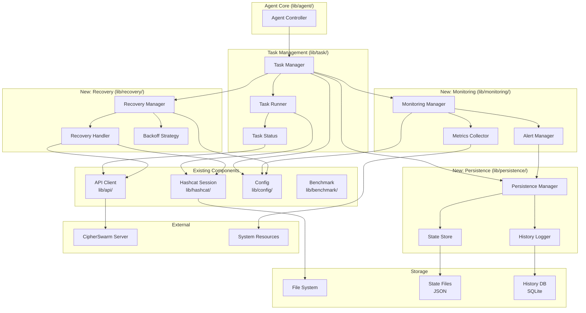
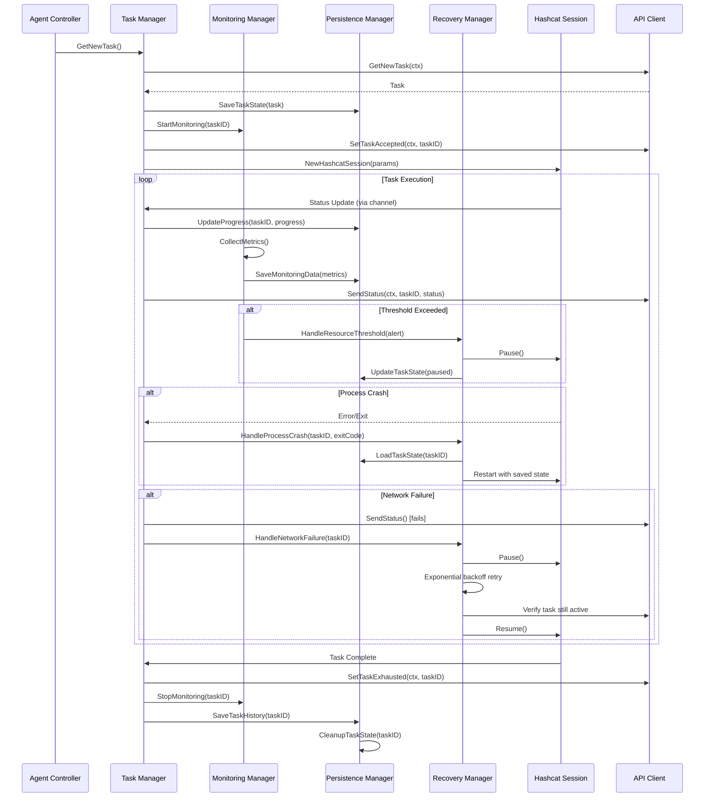

# Design Document

## Overview

The Enhanced Task Monitoring and Recovery System extends the existing CipherSwarmAgent with comprehensive monitoring, persistence, and recovery capabilities. The design maintains full compatibility with the existing v1 Agent API contract while adding robust task lifecycle management, real-time monitoring, and automatic recovery mechanisms.

The system is architected as a modular enhancement to the existing agent, introducing new packages under `lib/` for monitoring, state persistence, and recovery while preserving all current functionality. The design follows Go idioms and integrates seamlessly with the existing architecture:

- `lib/monitoring/` - System and task metrics collection
- `lib/persistence/` - Task state and history management  
- `lib/recovery/` - Automatic failure recovery logic
- Enhanced `lib/task/` - Integration with new monitoring and recovery capabilities

This approach leverages the existing modular structure, maintains the current API client architecture (generated client with wrapper), and provides clear interfaces that support future enhancements while ensuring backward compatibility.

## Architecture

### High-Level Architecture



### Component Interaction Flow



## Components and Interfaces

### 1. Monitoring Manager (lib/monitoring/)

**Purpose**: Provides real-time system and task monitoring with configurable thresholds.

**Package Structure**:
```
lib/monitoring/
├── manager.go       # Main monitoring manager
├── collector.go     # System metrics collection
├── alerts.go        # Alert generation and handling
├── config.go        # Monitoring configuration
└── types.go         # Monitoring data types
```

**Key Interfaces**:

```go
// Manager coordinates monitoring operations
type Manager struct {
    collectors map[string]*Collector
    config     *Config
    alerts     chan Alert
    mu         sync.RWMutex
}

// NewManager creates a monitoring manager with the given configuration
func NewManager(cfg *Config) *Manager {
    return &Manager{
        collectors: make(map[string]*Collector),
        config:     cfg,
        alerts:     make(chan Alert, 100),
    }
}

// StartMonitoring begins monitoring for a specific task
func (m *Manager) StartMonitoring(ctx context.Context, taskID string) error

// StopMonitoring stops monitoring for a specific task
func (m *Manager) StopMonitoring(taskID string) error

// GetCurrentMetrics retrieves current system metrics for a task
func (m *Manager) GetCurrentMetrics(taskID string) (*SystemMetrics, error)

// Alerts returns a channel for receiving monitoring alerts
func (m *Manager) Alerts() <-chan Alert

// SystemMetrics contains collected system and task metrics
type SystemMetrics struct {
    Timestamp       time.Time
    TaskID          string
    CPUUsage        float64
    MemoryUsage     float64
    MemoryAvailable int64
    DiskSpaceGB     int64
    GPUDevices      []GPUMetrics
    HashRate        float64
    Progress        float64
}

// GPUMetrics contains per-device GPU metrics
type GPUMetrics struct {
    DeviceID    int
    Temperature float64
    Utilization float64
    MemoryUsed  int64
    MemoryTotal int64
}

// Alert represents a monitoring threshold violation
type Alert struct {
    Type      AlertType
    Severity  AlertSeverity
    TaskID    string
    Message   string
    Timestamp time.Time
    Metrics   *SystemMetrics
}

// AlertType defines the type of monitoring alert
type AlertType int

const (
    AlertTypeGPUTemperature AlertType = iota
    AlertTypeMemoryUsage
    AlertTypeDiskSpace
    AlertTypeCPUUsage
)

// AlertSeverity defines alert severity levels
type AlertSeverity int

const (
    AlertSeverityInfo AlertSeverity = iota
    AlertSeverityWarning
    AlertSeverityCritical
)
```

**Responsibilities**:
- Collect system metrics (CPU, memory, GPU temperature, disk space)
- Monitor hashcat process performance and progress
- Evaluate configurable thresholds and generate alerts
- Provide real-time metrics for status updates
- Support per-device monitoring for multi-GPU systems
- Integration with existing `agentstate.State` for configuration

### 2. Persistence Manager (lib/persistence/)

**Purpose**: Manages task state persistence, recovery data, and execution history.

**Package Structure**:
```
lib/persistence/
├── manager.go       # Main persistence manager
├── state.go         # Task state operations
├── history.go       # Task history and analytics
├── store.go         # Storage backend (JSON files)
└── types.go         # Persistence data types
```

**Key Interfaces**:

```go
// Manager handles all persistence operations
type Manager struct {
    stateDir    string
    historyDB   *HistoryStore
    mu          sync.RWMutex
}

// NewManager creates a persistence manager with the given configuration
func NewManager(stateDir string, historyPath string) (*Manager, error)

// SaveTaskState persists the current task state atomically
func (m *Manager) SaveTaskState(state *TaskState) error

// LoadTaskState retrieves saved task state
func (m *Manager) LoadTaskState(taskID int64) (*TaskState, error)

// UpdateProgress atomically updates task progress
func (m *Manager) UpdateProgress(taskID int64, progress *TaskProgress) error

// CleanupTaskState removes state files for completed tasks
func (m *Manager) CleanupTaskState(taskID int64) error

// GetIncompleteTasksOnStartup scans for incomplete tasks
func (m *Manager) GetIncompleteTasksOnStartup() ([]*TaskState, error)

// SaveMonitoringSnapshot saves a monitoring data snapshot
func (m *Manager) SaveMonitoringSnapshot(taskID int64, metrics *monitoring.SystemMetrics) error

// SaveTaskHistory records completed task execution data
func (m *Manager) SaveTaskHistory(entry *TaskHistoryEntry) error

// GetTaskHistory retrieves historical task data with filters
func (m *Manager) GetTaskHistory(filters HistoryFilters) ([]*TaskHistoryEntry, error)

// TaskState represents the complete state of a task
type TaskState struct {
    TaskID          int64                  `json:"task_id"`
    AttackID        int64                  `json:"attack_id"`
    Status          string                 `json:"status"`
    HashcatParams   []string               `json:"hashcat_params"`
    Progress        *TaskProgress          `json:"progress"`
    StartTime       time.Time              `json:"start_time"`
    LastUpdate      time.Time              `json:"last_update"`
    FailureCount    int                    `json:"failure_count"`
    RecoveryData    map[string]interface{} `json:"recovery_data"`
    MonitoringSummary *MonitoringSummary   `json:"monitoring_summary,omitempty"`
}

// TaskProgress tracks task execution progress
type TaskProgress struct {
    KeyspacePosition int64     `json:"keyspace_position"`
    ProgressPercent  float64   `json:"progress_percent"`
    HashesRecovered  int       `json:"hashes_recovered"`
    RestorePoint     int64     `json:"restore_point"`
    EstimatedStop    time.Time `json:"estimated_stop"`
}

// MonitoringSummary contains aggregated monitoring data
type MonitoringSummary struct {
    AvgHashRate   float64 `json:"avg_hash_rate"`
    PeakGPUTemp   float64 `json:"peak_gpu_temp"`
    AvgGPUUtil    float64 `json:"avg_gpu_util"`
    AvgMemoryUsed float64 `json:"avg_memory_used"`
}

// TaskHistoryEntry represents a completed task record
type TaskHistoryEntry struct {
    TaskID          int64                  `json:"task_id"`
    AttackID        int64                  `json:"attack_id"`
    StartTime       time.Time              `json:"start_time"`
    EndTime         time.Time              `json:"end_time"`
    Duration        time.Duration          `json:"duration"`
    Status          string                 `json:"status"`
    HashesRecovered int                    `json:"hashes_recovered"`
    AvgHashRate     float64                `json:"avg_hash_rate"`
    PeakHashRate    float64                `json:"peak_hash_rate"`
    PeakGPUTemp     float64                `json:"peak_gpu_temp"`
    FailureCount    int                    `json:"failure_count"`
    Metadata        map[string]interface{} `json:"metadata,omitempty"`
}

// HistoryFilters defines query filters for task history
type HistoryFilters struct {
    StartDate  *time.Time
    EndDate    *time.Time
    Status     *string
    AttackID   *int64
    Limit      int
}
```

**Responsibilities**:
- Persist task state to local storage (JSON format)
- Manage atomic updates to prevent corruption
- Handle task state cleanup on completion
- Provide task history and analytics data
- Support agent-specific state directories for multi-agent systems
- Integrate with existing file system paths from `agentstate.State`

### 3. Recovery Manager (lib/recovery/)

**Purpose**: Handles automatic recovery from various failure scenarios.

**Package Structure**:
```
lib/recovery/
├── manager.go       # Main recovery manager
├── handlers.go      # Specific recovery handlers
├── backoff.go       # Exponential backoff logic
├── strategy.go      # Recovery strategy definitions
└── types.go         # Recovery data types
```

**Key Interfaces**:

```go
// Manager coordinates recovery operations
type Manager struct {
    persistence *persistence.Manager
    monitoring  *monitoring.Manager
    config      *Config
    strategies  map[FailureType]*Strategy
}

// NewManager creates a recovery manager with dependencies
func NewManager(
    pm *persistence.Manager,
    mm *monitoring.Manager,
    cfg *Config,
) *Manager

// HandleNetworkFailure manages network connectivity issues
func (m *Manager) HandleNetworkFailure(ctx context.Context, taskID int64) error

// HandleProcessCrash manages hashcat process crashes
func (m *Manager) HandleProcessCrash(ctx context.Context, taskID int64, exitCode int, stderr string) error

// HandleResourceThreshold manages resource-based throttling
func (m *Manager) HandleResourceThreshold(ctx context.Context, taskID int64, alert monitoring.Alert) error

// AttemptTaskRecovery attempts to recover a failed task
func (m *Manager) AttemptTaskRecovery(ctx context.Context, taskID int64) error

// ShouldRetryTask determines if a task should be retried
func (m *Manager) ShouldRetryTask(taskID int64, failureCount int) bool

// FailureType categorizes different failure scenarios
type FailureType int

const (
    FailureTypeNetwork FailureType = iota
    FailureTypeProcessCrash
    FailureTypeResourceThreshold
    FailureTypeUnknown
)

// Strategy defines recovery behavior for a failure type
type Strategy struct {
    MaxRetries      int
    BackoffStart    time.Duration
    BackoffMax      time.Duration
    BackoffMultiplier float64
    RecoveryActions []RecoveryAction
}

// RecoveryAction defines a specific recovery step
type RecoveryAction func(ctx context.Context, taskID int64) error

// BackoffCalculator implements exponential backoff
type BackoffCalculator struct {
    start      time.Duration
    max        time.Duration
    multiplier float64
    attempt    int
}

// NextDelay calculates the next backoff delay
func (b *BackoffCalculator) NextDelay() time.Duration

// Reset resets the backoff calculator
func (b *BackoffCalculator) Reset()
```

**Responsibilities**:
- Implement exponential backoff for network failures
- Handle hashcat process crashes and restarts
- Manage resource-based throttling (temperature, memory)
- Coordinate with persistence manager for state recovery
- Report unrecoverable failures via `cserrors.LogAndSendError`
- Integrate with existing `lib/hashcat/session.go` for process management

### 4. Task Manager Enhancement (lib/task/)

### 4. Task Manager Enhancement (lib/task/)

**Purpose**: Extends existing task management with monitoring integration and state persistence.

**Enhanced Manager Structure**:

```go
// Manager orchestrates task lifecycle with monitoring and recovery
type Manager struct {
    tasksClient    api.TasksClient
    attacksClient  api.AttacksClient
    monitoring     *monitoring.Manager
    persistence    *persistence.Manager
    recovery       *recovery.Manager
    BackendDevices string
    OpenCLDevices  string
}

// NewManager creates a task manager with all dependencies
func NewManager(
    tc api.TasksClient,
    ac api.AttacksClient,
    mm *monitoring.Manager,
    pm *persistence.Manager,
    rm *recovery.Manager,
) *Manager

// RunTaskWithMonitoring executes a task with full monitoring and recovery
func (m *Manager) RunTaskWithMonitoring(ctx context.Context, task *api.Task, attack *api.Attack) error

// PauseTask pauses task execution (for resource throttling)
func (m *Manager) PauseTask(ctx context.Context, taskID int64) error

// ResumeTask resumes a paused task
func (m *Manager) ResumeTask(ctx context.Context, taskID int64) error

// GetTaskStatus retrieves current task status with monitoring data
func (m *Manager) GetTaskStatus(taskID int64) (*EnhancedTaskStatus, error)

// EnhancedTaskStatus extends api.TaskStatus with monitoring data
type EnhancedTaskStatus struct {
    *api.TaskStatus
    SystemMetrics *monitoring.SystemMetrics `json:"system_metrics,omitempty"`
    RecoveryInfo  *RecoveryInfo             `json:"recovery_info,omitempty"`
}

// RecoveryInfo contains task recovery metadata
type RecoveryInfo struct {
    FailureCount      int       `json:"failure_count"`
    LastFailureTime   time.Time `json:"last_failure_time,omitempty"`
    LastFailureReason string    `json:"last_failure_reason,omitempty"`
    RecoveryAttempts  int       `json:"recovery_attempts"`
}
```

**Integration Points**:
- Wraps existing `RunTask` with monitoring and persistence
- Integrates with `lib/hashcat/session.go` for process management
- Uses existing `api.TasksClient` interface for server communication
- Coordinates with recovery manager for failure handling
- Maintains backward compatibility with existing task execution flow

### 5. Configuration Enhancement (lib/config/)

**Purpose**: Extends existing configuration with monitoring and recovery settings.

**New Configuration Constants**:

```go
// Monitoring configuration defaults
const (
    DefaultMonitoringEnabled         = true
    DefaultMonitoringIntervalSeconds = 3
    DefaultGPUTempThreshold          = 80.0
    DefaultMemoryThresholdPercent    = 90.0
    DefaultDiskSpaceThresholdGB      = 1.0
)

// Recovery configuration defaults
const (
    DefaultRecoveryMaxRetries              = 3
    DefaultNetworkBackoffStartSeconds      = 1
    DefaultNetworkBackoffMaxSeconds        = 300
    DefaultProcessRestartDelaySeconds      = 5
    DefaultTemperatureResumeDelta          = 5.0
)

// Persistence configuration defaults
const (
    DefaultPersistenceEnabled         = true
    DefaultStateDirectory             = "states"
    DefaultHistoryRetentionDays       = 30
    DefaultHistoryMaxSizeMB           = 100
    DefaultCleanupOnCompletion        = true
)

// Analytics configuration defaults
const (
    DefaultAnalyticsEnabled         = true
    DefaultPerformanceTracking      = true
)
```

**YAML Configuration Schema**:

```yaml
monitoring:
  enabled: true
  interval_seconds: 3
  gpu_temp_threshold: 80.0
  memory_threshold_percent: 90.0
  disk_space_threshold_gb: 1.0
  per_device_thresholds: {}

recovery:
  max_retries: 3
  network_backoff_start_seconds: 1
  network_backoff_max_seconds: 300
  process_restart_delay_seconds: 5
  temperature_resume_delta: 5.0

persistence:
  enabled: true
  state_directory: "states"
  history_retention_days: 30
  history_max_size_mb: 100
  cleanup_on_completion: true

analytics:
  enabled: true
  export_formats: ["json", "csv"]
  performance_tracking: true
```

**Integration with agentstate.State**:

```go
// Enhanced State fields (added to agentstate/agentstate.go)
type State struct {
    // ... existing fields ...
    
    // Monitoring manager instance
    MonitoringManager *monitoring.Manager
    
    // Persistence manager instance
    PersistenceManager *persistence.Manager
    
    // Recovery manager instance
    RecoveryManager *recovery.Manager
    
    // Monitoring configuration
    MonitoringEnabled         atomic.Bool
    MonitoringIntervalSeconds atomic.Int32
    GPUTempThreshold          atomic.Value // float64
    MemoryThresholdPercent    atomic.Value // float64
    
    // Recovery configuration
    RecoveryMaxRetries        atomic.Int32
    NetworkBackoffStartSec    atomic.Int32
    NetworkBackoffMaxSec      atomic.Int32
    
    // Persistence configuration
    PersistenceEnabled        atomic.Bool
    StateDirectory            string
    HistoryRetentionDays      atomic.Int32
}
```

**Responsibilities**:
- Provide configuration defaults in `lib/config/config.go`
- Load configuration via Viper in `cmd/root.go`
- Store configuration in `agentstate.State` for global access
- Support CLI flag and environment variable overrides
- Validate configuration values with sensible defaults

## Data Models

### Task State Schema (JSON)

Persisted to `{state_directory}/{agent_id}/task_{task_id}.json`:

```json
{
  "task_id": 12345,
  "attack_id": 67890,
  "status": "running",
  "hashcat_params": [
    "-a", "0",
    "-m", "1000",
    "/path/to/hashes.txt",
    "/path/to/wordlist.txt"
  ],
  "progress": {
    "keyspace_position": 1234567890,
    "progress_percent": 45.6,
    "hashes_recovered": 10,
    "restore_point": 1234560000,
    "estimated_stop": "2024-01-01T12:00:00Z"
  },
  "start_time": "2024-01-01T10:00:00Z",
  "last_update": "2024-01-01T11:30:00Z",
  "failure_count": 0,
  "recovery_data": {
    "last_checkpoint": 1234560000,
    "network_failures": 0,
    "process_restarts": 0,
    "last_failure_type": "",
    "last_failure_time": null
  },
  "monitoring_summary": {
    "avg_hash_rate": 1000000.0,
    "peak_gpu_temp": 75.0,
    "avg_gpu_util": 95.0,
    "avg_memory_used": 78.5
  }
}
```

### Monitoring Snapshot Schema (JSON)

Persisted to `{state_directory}/{agent_id}/monitoring_{task_id}_{timestamp}.json`:

```json
{
  "timestamp": "2024-01-01T12:00:00Z",
  "task_id": 12345,
  "system_metrics": {
    "cpu_usage": 45.2,
    "memory_usage": 78.5,
    "memory_available": 8589934592,
    "disk_space_gb": 150,
    "gpu_devices": [
      {
        "device_id": 0,
        "temperature": 75.0,
        "utilization": 95.0,
        "memory_used": 6442450944,
        "memory_total": 8589934592
      }
    ]
  },
  "task_metrics": {
    "hash_rate": 1000000.0,
    "progress_percent": 45.6,
    "hashes_recovered": 10,
    "session_uptime_seconds": 3600
  }
}
```

### Task History Schema (SQLite)

Table: `task_history`

```sql
CREATE TABLE task_history (
    id INTEGER PRIMARY KEY AUTOINCREMENT,
    task_id INTEGER NOT NULL,
    attack_id INTEGER NOT NULL,
    start_time DATETIME NOT NULL,
    end_time DATETIME NOT NULL,
    duration_seconds INTEGER NOT NULL,
    status TEXT NOT NULL,
    hashes_recovered INTEGER NOT NULL DEFAULT 0,
    avg_hash_rate REAL NOT NULL DEFAULT 0.0,
    peak_hash_rate REAL NOT NULL DEFAULT 0.0,
    peak_gpu_temp REAL NOT NULL DEFAULT 0.0,
    failure_count INTEGER NOT NULL DEFAULT 0,
    metadata TEXT,
    created_at DATETIME DEFAULT CURRENT_TIMESTAMP
);

CREATE INDEX idx_task_history_task_id ON task_history(task_id);
CREATE INDEX idx_task_history_attack_id ON task_history(attack_id);
CREATE INDEX idx_task_history_start_time ON task_history(start_time);
CREATE INDEX idx_task_history_status ON task_history(status);
```

### Enhanced Status Update Payload

Extends existing `api.TaskStatus` with monitoring data:

```go
// EnhancedStatusUpdate wraps api.TaskStatus with monitoring context
type EnhancedStatusUpdate struct {
    // Standard task status fields (from api.TaskStatus)
    Session         string                `json:"session"`
    Status          string                `json:"status"`
    Progress        []int64               `json:"progress"`
    RestorePoint    int64                 `json:"restore_point"`
    RecoveredHashes int                   `json:"recovered_hashes"`
    RecoveredSalts  int                   `json:"recovered_salts"`
    Rejected        int                   `json:"rejected"`
    DeviceStatuses  []api.DeviceStatus    `json:"device_statuses"`
    TimeStart       time.Time             `json:"time_start"`
    EstimatedStop   time.Time             `json:"estimated_stop"`
    
    // Enhanced monitoring fields (optional, backward compatible)
    SystemMetrics   *SystemMetricsPayload `json:"system_metrics,omitempty"`
}

// SystemMetricsPayload contains monitoring data for status updates
type SystemMetricsPayload struct {
    CPUUsage        float64       `json:"cpu_usage"`
    MemoryUsage     float64       `json:"memory_usage"`
    MemoryAvailable int64         `json:"memory_available"`
    DiskSpaceGB     int64         `json:"disk_space_gb"`
    GPUDevices      []GPUMetrics  `json:"gpu_devices,omitempty"`
}
```

**Note**: The enhanced fields are optional and backward compatible. Existing servers that don't expect these fields will ignore them.

## Error Handling

### Error Categories and Recovery Strategies

The enhanced system integrates with the existing `cserrors` package and extends error handling with recovery capabilities.

#### 1. Network Failures

**Detection**:
- API call failures with network-related errors
- Timeout errors from HTTP client
- Connection refused or DNS resolution failures

**Recovery Strategy**:
```go
// Implemented in lib/recovery/handlers.go
func (m *Manager) HandleNetworkFailure(ctx context.Context, taskID int64) error {
    // 1. Pause hashcat process
    if err := m.pauseHashcatProcess(taskID); err != nil {
        agentstate.Logger.Warn("Failed to pause hashcat during network failure",
            "task_id", taskID, "error", err)
    }
    
    // 2. Update task state
    state, err := m.persistence.LoadTaskState(taskID)
    if err != nil {
        return fmt.Errorf("failed to load task state: %w", err)
    }
    
    state.Status = "paused"
    state.RecoveryData["network_failures"] = state.RecoveryData["network_failures"].(int) + 1
    state.RecoveryData["last_failure_type"] = "network"
    state.RecoveryData["last_failure_time"] = time.Now()
    
    if err := m.persistence.SaveTaskState(state); err != nil {
        return fmt.Errorf("failed to save task state: %w", err)
    }
    
    // 3. Implement exponential backoff
    backoff := NewBackoffCalculator(
        time.Duration(agentstate.State.NetworkBackoffStartSec.Load()) * time.Second,
        time.Duration(agentstate.State.NetworkBackoffMaxSec.Load()) * time.Second,
        2.0,
    )
    
    for attempt := 0; attempt < agentstate.State.RecoveryMaxRetries.Load(); attempt++ {
        delay := backoff.NextDelay()
        agentstate.Logger.Info("Waiting before network retry",
            "task_id", taskID, "attempt", attempt+1, "delay", delay)
        
        select {
        case <-ctx.Done():
            return ctx.Err()
        case <-time.After(delay):
        }
        
        // 4. Verify task still active on server
        task, err := agentstate.State.Client.Tasks().GetNewTask(ctx)
        if err == nil && task != nil {
            // Network restored, resume task
            return m.resumeHashcatProcess(taskID)
        }
    }
    
    // 5. Max retries exceeded, report failure
    return cserrors.LogAndSendError(ctx,
        "Network failure recovery exhausted",
        fmt.Errorf("max retries (%d) exceeded", agentstate.State.RecoveryMaxRetries.Load()),
        api.SeverityCritical,
        &api.Task{Id: taskID},
    )
}
```

**Error Reporting**:
- Use `cserrors.LogAndSendError` with `api.SeverityWarning` for transient failures
- Use `api.SeverityCritical` when max retries exceeded
- Include recovery attempt count in error metadata

#### 2. Process Crashes

**Detection**:
- Hashcat process exits with non-zero exit code
- Unexpected process termination
- Parse exit code using `lib/hashcat/exitcode.go`

**Recovery Strategy**:
```go
// Implemented in lib/recovery/handlers.go
func (m *Manager) HandleProcessCrash(ctx context.Context, taskID int64, exitCode int, stderr string) error {
    agentstate.Logger.Error("Hashcat process crashed",
        "task_id", taskID, "exit_code", exitCode, "stderr", stderr)
    
    // 1. Load task state
    state, err := m.persistence.LoadTaskState(taskID)
    if err != nil {
        return fmt.Errorf("failed to load task state: %w", err)
    }
    
    // 2. Increment failure count
    state.FailureCount++
    state.RecoveryData["process_restarts"] = state.RecoveryData["process_restarts"].(int) + 1
    state.RecoveryData["last_failure_type"] = "process_crash"
    state.RecoveryData["last_failure_time"] = time.Now()
    state.RecoveryData["last_exit_code"] = exitCode
    state.RecoveryData["last_stderr"] = stderr
    
    // 3. Check if should retry
    if !m.ShouldRetryTask(taskID, state.FailureCount) {
        state.Status = "failed"
        if err := m.persistence.SaveTaskState(state); err != nil {
            agentstate.Logger.Warn("Failed to save failed task state", "error", err)
        }
        
        return cserrors.LogAndSendError(ctx,
            fmt.Sprintf("Task failed after %d attempts", state.FailureCount),
            fmt.Errorf("hashcat exit code %d: %s", exitCode, stderr),
            api.SeverityCritical,
            &api.Task{Id: taskID},
            cserrors.WithClassification("process_crash", false),
        )
    }
    
    // 4. Save state and wait before restart
    if err := m.persistence.SaveTaskState(state); err != nil {
        return fmt.Errorf("failed to save task state: %w", err)
    }
    
    delay := time.Duration(agentstate.State.ProcessRestartDelaySeconds.Load()) * time.Second
    agentstate.Logger.Info("Waiting before process restart",
        "task_id", taskID, "delay", delay, "attempt", state.FailureCount)
    
    select {
    case <-ctx.Done():
        return ctx.Err()
    case <-time.After(delay):
    }
    
    // 5. Restart hashcat with same parameters from restore point
    return m.restartHashcatProcess(ctx, taskID, state)
}
```

**Error Reporting**:
- Capture and include exit code and stderr in error reports
- Use `cserrors.WithClassification` to mark as non-retryable after max attempts
- Include failure count in error metadata

#### 3. Resource Threshold Violations

**Detection**:
- Monitoring alerts from `lib/monitoring/alerts.go`
- GPU temperature exceeds threshold
- Memory usage exceeds threshold
- Disk space below threshold

**Recovery Strategy**:
```go
// Implemented in lib/recovery/handlers.go
func (m *Manager) HandleResourceThreshold(ctx context.Context, taskID int64, alert monitoring.Alert) error {
    agentstate.Logger.Warn("Resource threshold exceeded",
        "task_id", taskID, "alert_type", alert.Type, "severity", alert.Severity)
    
    switch alert.Type {
    case monitoring.AlertTypeGPUTemperature:
        return m.handleGPUTemperature(ctx, taskID, alert)
    case monitoring.AlertTypeMemoryUsage:
        return m.handleMemoryUsage(ctx, taskID, alert)
    case monitoring.AlertTypeDiskSpace:
        return m.handleDiskSpace(ctx, taskID, alert)
    default:
        agentstate.Logger.Warn("Unknown alert type", "type", alert.Type)
        return nil
    }
}

func (m *Manager) handleGPUTemperature(ctx context.Context, taskID int64, alert monitoring.Alert) error {
    // 1. Pause task execution
    if err := m.pauseHashcatProcess(taskID); err != nil {
        return fmt.Errorf("failed to pause task: %w", err)
    }
    
    // 2. Update task state
    state, err := m.persistence.LoadTaskState(taskID)
    if err != nil {
        return fmt.Errorf("failed to load task state: %w", err)
    }
    
    state.Status = "paused"
    state.RecoveryData["pause_reason"] = "gpu_temperature"
    state.RecoveryData["pause_time"] = time.Now()
    
    if err := m.persistence.SaveTaskState(state); err != nil {
        return fmt.Errorf("failed to save task state: %w", err)
    }
    
    // 3. Monitor temperature until it drops
    threshold := agentstate.State.GPUTempThreshold.Load().(float64)
    resumeThreshold := threshold - agentstate.State.TemperatureResumeDelta.Load().(float64)
    
    ticker := time.NewTicker(10 * time.Second)
    defer ticker.Stop()
    
    for {
        select {
        case <-ctx.Done():
            return ctx.Err()
        case <-ticker.C:
            metrics, err := m.monitoring.GetCurrentMetrics(fmt.Sprintf("%d", taskID))
            if err != nil {
                agentstate.Logger.Warn("Failed to get metrics during temperature monitoring", "error", err)
                continue
            }
            
            maxTemp := 0.0
            for _, gpu := range metrics.GPUDevices {
                if gpu.Temperature > maxTemp {
                    maxTemp = gpu.Temperature
                }
            }
            
            if maxTemp < resumeThreshold {
                agentstate.Logger.Info("GPU temperature normalized, resuming task",
                    "task_id", taskID, "temperature", maxTemp, "threshold", resumeThreshold)
                return m.resumeHashcatProcess(taskID)
            }
            
            agentstate.Logger.Debug("Waiting for GPU temperature to drop",
                "task_id", taskID, "current", maxTemp, "target", resumeThreshold)
        }
    }
}
```

**Error Reporting**:
- Log warnings for threshold violations
- Use `api.SeverityWarning` for temporary pauses
- Use `api.SeverityCritical` only if unable to recover

#### 4. State Persistence Failures

**Detection**:
- File system errors during state save/load
- JSON marshaling/unmarshaling errors
- Permission errors

**Recovery Strategy**:
```go
// Implemented in lib/persistence/state.go
func (m *Manager) SaveTaskState(state *TaskState) error {
    // 1. Marshal to JSON
    data, err := json.MarshalIndent(state, "", "  ")
    if err != nil {
        agentstate.Logger.Error("Failed to marshal task state", "task_id", state.TaskID, "error", err)
        return fmt.Errorf("failed to marshal task state: %w", err)
    }
    
    // 2. Write atomically using temp file + rename
    stateFile := filepath.Join(m.stateDir, fmt.Sprintf("task_%d.json", state.TaskID))
    tempFile := stateFile + ".tmp"
    
    //nolint:gosec // G306 - state files need to be readable by the agent user
    if err := os.WriteFile(tempFile, data, 0644); err != nil {
        agentstate.Logger.Error("Failed to write temp state file",
            "task_id", state.TaskID, "file", tempFile, "error", err)
        return fmt.Errorf("failed to write temp state file: %w", err)
    }
    
    if err := os.Rename(tempFile, stateFile); err != nil {
        agentstate.Logger.Error("Failed to rename state file",
            "task_id", state.TaskID, "file", stateFile, "error", err)
        // Clean up temp file
        _ = os.Remove(tempFile)
        return fmt.Errorf("failed to rename state file: %w", err)
    }
    
    agentstate.Logger.Debug("Task state saved", "task_id", state.TaskID, "file", stateFile)
    return nil
}
```

**Error Handling**:
- Log errors but continue task execution (graceful degradation)
- Use atomic file operations (write to temp, then rename)
- Clean up temporary files on failure
- Don't block task execution on persistence failures

### Integration with Existing Error Reporting

All error reporting integrates with the existing `cserrors` package:

```go
// Use existing LogAndSendError for all error reporting
err := cserrors.LogAndSendError(ctx,
    "Error message",
    underlyingError,
    api.SeverityCritical,
    task,
    cserrors.WithClassification("error_category", retryable),
)

// Error metadata automatically includes:
// - Platform information (OS, architecture)
// - Agent version
// - Task ID and attack ID
// - Timestamp
// - Custom classification and retryability
```

### Error Severity Guidelines

- **Info**: Informational events, successful recovery
- **Warning**: Transient failures, automatic recovery in progress
- **Critical**: Unrecoverable failures, max retries exceeded, data loss risk

## Correctness Properties

*A property is a characteristic or behavior that should hold true across all valid executions of a system—essentially, a formal statement about what the system should do. Properties serve as the bridge between human-readable specifications and machine-verifiable correctness guarantees.*

Before defining the correctness properties, I need to analyze the acceptance criteria from the requirements document to determine which are testable as properties, examples, or edge cases.

### Acceptance Criteria Testing Prework

**Requirement 1: Comprehensive Task Monitoring**

1.1. WHEN a task is accepted by the agent THEN the system SHALL create a detailed task execution log
  Thoughts: This is about creating a log entry when a specific event occurs. We can test that for any task acceptance, a log entry is created with the required fields.
  Testable: yes - property

1.2. WHEN a task is executing THEN the system SHALL collect and report performance metrics at configurable intervals
  Thoughts: This is about continuous metric collection during execution. We can test that metrics are collected at the configured interval for any running task.
  Testable: yes - property

1.3. WHEN system resources exceed defined thresholds THEN the system SHALL automatically throttle or pause task execution
  Thoughts: This is about the system's response to threshold violations. We can generate random resource states and verify that when thresholds are exceeded, the appropriate action is taken.
  Testable: yes - property

1.4. WHEN a task completes successfully THEN the system SHALL generate a comprehensive completion report
  Thoughts: This is about generating a report for any completed task. We can test that for any task completion, a report with required fields is generated.
  Testable: yes - property

1.5. WHEN monitoring data is collected THEN the system SHALL maintain compatibility with existing API endpoint format
  Thoughts: This is about data format compatibility. We can test that for any monitoring data, the serialized format matches the expected API schema.
  Testable: yes - property

1.6. WHEN the agent sends heartbeats THEN the system SHALL include current task status and system health metrics
  Thoughts: This is about heartbeat payload content. We can test that for any heartbeat, the payload contains the required fields.
  Testable: yes - property

**Requirement 2: Automatic Task Recovery**

2.1. WHEN a network connection is lost during task execution THEN the system SHALL pause the current hashcat process and attempt reconnection using exponential backoff
  Thoughts: This is about the system's response to network failures. We can test that for any network failure, the process is paused and backoff is applied.
  Testable: yes - property

2.2. WHEN network connectivity is restored THEN the system SHALL validate the task is still active and resume
  Thoughts: This is about resumption after network recovery. We can test that for any network restoration, validation and resumption occur.
  Testable: yes - property

2.3. WHEN a hashcat process crashes unexpectedly THEN the system SHALL capture the exit code and stderr, then automatically restart
  Thoughts: This is about crash handling. We can test that for any process crash, exit code/stderr are captured and restart occurs.
  Testable: yes - property

2.4. IF a task fails more than 3 consecutive times THEN the system SHALL mark the task as failed and report the failure
  Thoughts: This is about failure threshold handling. We can test that for any task with >3 failures, it's marked as failed and reported.
  Testable: yes - property

2.5. WHEN GPU temperature exceeds the configured threshold THEN the system SHALL pause task execution and resume when temperature drops
  Thoughts: This is about temperature-based throttling. We can test that for any temperature threshold violation, pause and resume occur correctly.
  Testable: yes - property

2.6. WHEN the agent process is terminated unexpectedly THEN the system SHALL be able to resume incomplete tasks on restart
  Thoughts: This is about persistence and recovery across restarts. We can test that for any incomplete task state, it can be loaded and resumed.
  Testable: yes - property

2.7. WHEN resuming a task THEN the system SHALL verify task parameters haven't changed on the server
  Thoughts: This is about validation during resumption. We can test that for any task resumption, server validation occurs.
  Testable: yes - property

**Requirement 3: Task State Persistence**

3.1. WHEN a task begins execution THEN the system SHALL persist task state to local storage in JSON format
  Thoughts: This is about initial state persistence. We can test that for any task start, a valid JSON state file is created.
  Testable: yes - property

3.2. WHEN task progress updates occur THEN the system SHALL atomically update the persisted state
  Thoughts: This is about atomic updates. We can test that for any progress update, the state file is updated atomically (no partial writes).
  Testable: yes - property

3.3. WHEN the agent starts up THEN the system SHALL scan for incomplete task state files and automatically attempt to resume them
  Thoughts: This is about startup recovery. We can test that for any set of incomplete state files, they are all discovered and processed.
  Testable: yes - property

3.4. WHEN resuming an incomplete task THEN the system SHALL validate the task is still active on the server
  Thoughts: This is about validation during resume. We can test that for any incomplete task, server validation is performed.
  Testable: yes - property

3.5. WHEN a task is completed, cancelled, or marked as exhausted THEN the system SHALL clean up the persisted state files
  Thoughts: This is about cleanup. We can test that for any terminal task state, the state files are removed.
  Testable: yes - property

3.6. WHEN state persistence fails THEN the system SHALL log the error but continue task execution
  Thoughts: This is about graceful degradation. We can test that for any persistence failure, execution continues and an error is logged.
  Testable: yes - property

3.7. WHEN multiple agents run on the same system THEN the system SHALL use agent-specific state directories
  Thoughts: This is about isolation. We can test that for any agent ID, a unique state directory is used.
  Testable: yes - property

**Requirement 4: Configurable Monitoring Thresholds**

4.1. WHEN the agent starts THEN the system SHALL load monitoring configuration with sensible defaults
  Thoughts: This is about configuration loading. We can test that for any missing config values, defaults are applied.
  Testable: yes - property

4.2. WHEN monitoring thresholds are exceeded THEN the system SHALL log appropriate messages
  Thoughts: This is about logging behavior. We can test that for any threshold violation, a log entry is created.
  Testable: yes - property

4.3. IF custom monitoring rules are defined in configuration THEN the system SHALL evaluate and apply those rules
  Thoughts: This is about custom rule evaluation. We can test that for any custom rule, it's correctly evaluated.
  Testable: yes - property

4.4. WHEN configuration supports it THEN the system SHALL allow per-device thresholds for multi-GPU systems
  Thoughts: This is about per-device configuration. We can test that for any device-specific threshold, it's applied to the correct device.
  Testable: yes - property

4.5. WHEN the system detects configuration file changes THEN the system SHALL reload monitoring parameters
  Thoughts: This is about dynamic configuration reload. This is a feature requirement but testing file watching is complex and may be better as an integration test.
  Testable: no

4.6. WHEN environment variables or CLI flags override config file values THEN the system SHALL prioritize the override values
  Thoughts: This is about configuration precedence. We can test that for any override, it takes precedence over file values.
  Testable: yes - property

**Requirement 5: Task Execution History and Analytics**

5.1. WHEN tasks complete THEN the system SHALL store execution history
  Thoughts: This is about history storage. We can test that for any completed task, a history entry is created with required fields.
  Testable: yes - property

5.2. WHEN requested via CLI command THEN the system SHALL provide task execution statistics
  Thoughts: This is about CLI output. This is more of an integration test of the CLI command.
  Testable: no

5.3. WHEN storage limits are reached THEN the system SHALL automatically rotate old execution logs
  Thoughts: This is about log rotation. We can test that when storage exceeds the limit, old logs are removed.
  Testable: yes - property

5.4. WHEN exporting data THEN the system SHALL provide task history in structured formats
  Thoughts: This is about export functionality. We can test that for any history data, it can be exported in the specified formats.
  Testable: yes - property

5.5. WHEN benchmark data is collected THEN the system SHALL store historical benchmark results
  Thoughts: This is about benchmark history. We can test that for any benchmark result, it's stored in history.
  Testable: yes - property

**Requirement 6: API Compatibility**

6.1. WHEN implementing monitoring features THEN the system SHALL maintain strict compatibility with all existing v1 Agent API endpoints
  Thoughts: This is about API compatibility. We can test that all API calls use the correct endpoints and formats.
  Testable: yes - property

6.2. WHEN sending status updates THEN the system SHALL use the exact JSON schema format expected by the current server
  Thoughts: This is about schema compliance. We can test that for any status update, the JSON matches the expected schema.
  Testable: yes - property

6.3. WHEN handling authentication THEN the system SHALL support the existing Bearer token authentication mechanism
  Thoughts: This is about auth mechanism. We can test that authentication uses Bearer tokens correctly.
  Testable: yes - property

6.4. WHEN reporting errors THEN the system SHALL use the structured error format defined in the current API specification
  Thoughts: This is about error format. We can test that for any error report, the format matches the API spec.
  Testable: yes - property

6.5. WHEN implementing new features THEN the system SHALL not break existing server-side expectations
  Thoughts: This is a general compatibility goal, not a specific testable behavior.
  Testable: no

6.6. WHEN the agent shuts down THEN the system SHALL properly notify the server using the existing endpoint
  Thoughts: This is about shutdown notification. We can test that shutdown calls the correct endpoint.
  Testable: yes - property

### Property Reflection

After reviewing all properties, I'll identify any redundancy:

- Properties 2.2 and 2.7 both test server validation during task resumption - these can be combined
- Properties 3.4 and 2.7 are duplicates - both test server validation during resume
- Properties 1.5 and 6.2 both test API format compatibility for status updates - these can be combined
- Properties 4.2 and 1.3 both involve threshold violations but test different aspects (logging vs. action) - keep separate

Consolidated properties:
- Combine 2.2, 2.7, and 3.4 into a single "Task resumption validation" property
- Combine 1.5 and 6.2 into a single "Status update format compatibility" property

### Correctness Properties

**Property 1: Task state persistence round-trip**
*For any* task state, persisting it to disk and then loading it back should produce an equivalent state object with all fields preserved.
**Validates: Requirements 3.1, 3.2**

**Property 2: Monitoring metrics collection interval**
*For any* running task with a configured monitoring interval, metrics should be collected at intervals within ±10% of the configured value.
**Validates: Requirements 1.2**

**Property 3: Threshold violation triggers action**
*For any* system metric that exceeds its configured threshold, the system should generate an alert and take the configured action (pause, throttle, or log).
**Validates: Requirements 1.3, 4.2**

**Property 4: Task completion generates history**
*For any* task that reaches a terminal state (completed, failed, exhausted), a history entry should be created containing all required fields (task ID, duration, status, metrics).
**Validates: Requirements 1.4, 5.1**

**Property 5: Network failure triggers exponential backoff**
*For any* network failure during task execution, the recovery manager should pause the task and apply exponential backoff with delays increasing by the configured multiplier up to the maximum.
**Validates: Requirements 2.1**

**Property 6: Task resumption validates server state**
*For any* task being resumed (after network failure, restart, or crash), the system should verify with the server that the task is still active before continuing execution.
**Validates: Requirements 2.2, 2.7, 3.4**

**Property 7: Process crash triggers restart with limit**
*For any* hashcat process crash, the system should capture exit code and stderr, then restart the process unless the failure count exceeds the configured maximum.
**Validates: Requirements 2.3, 2.4**

**Property 8: Temperature throttling round-trip**
*For any* GPU temperature threshold violation, the system should pause execution, and when temperature drops below (threshold - delta), resume execution.
**Validates: Requirements 2.5**

**Property 9: Incomplete tasks discovered on startup**
*For any* set of task state files present at agent startup, all files with non-terminal status should be identified and queued for recovery.
**Validates: Requirements 2.6, 3.3**

**Property 10: Terminal task states trigger cleanup**
*For any* task that reaches a terminal state (completed, failed, exhausted, cancelled), the associated state files should be removed from disk.
**Validates: Requirements 3.5**

**Property 11: Persistence failures don't block execution**
*For any* state persistence operation that fails, the task execution should continue and an error should be logged at Warning level.
**Validates: Requirements 3.6**

**Property 12: Agent-specific state directories**
*For any* agent ID, the state directory path should include the agent ID as a component, ensuring isolation between agents.
**Validates: Requirements 3.7**

**Property 13: Configuration defaults applied**
*For any* monitoring configuration parameter that is missing or invalid, the system should use the defined default value from `lib/config/config.go`.
**Validates: Requirements 4.1**

**Property 14: Per-device thresholds applied correctly**
*For any* multi-GPU system with per-device thresholds configured, alerts should be generated using the device-specific threshold for each device.
**Validates: Requirements 4.4**

**Property 15: Configuration override precedence**
*For any* configuration parameter, values should be applied in order of precedence: CLI flags > environment variables > config file > defaults.
**Validates: Requirements 4.6**

**Property 16: History storage rotation**
*For any* history database that exceeds the configured size limit, the oldest entries should be removed until the size is below the limit.
**Validates: Requirements 5.3**

**Property 17: History export format validity**
*For any* task history export in JSON or CSV format, the output should be valid according to the format specification and parseable by standard tools.
**Validates: Requirements 5.4**

**Property 18: API endpoint compatibility**
*For any* API call made by the enhanced system, the endpoint path and HTTP method should match exactly those defined in `docs/swagger.json`.
**Validates: Requirements 6.1**

**Property 19: Status update schema compliance**
*For any* status update sent to the server, the JSON payload should validate against the TaskStatus schema in `docs/swagger.json`, with enhanced fields being optional.
**Validates: Requirements 1.5, 6.2**

**Property 20: Bearer token authentication**
*For any* API request, the Authorization header should be present with format "Bearer {token}" where token is the configured agent token.
**Validates: Requirements 6.3**

**Property 21: Error report format compliance**
*For any* error reported to the server, the payload should match the SubmitErrorAgentJSONRequestBody schema in `docs/swagger.json`.
**Validates: Requirements 6.4**

**Property 22: Shutdown notification**
*For any* agent shutdown (graceful or after cleanup), the system should call the `/agents/{id}/shutdown` endpoint before terminating.
**Validates: Requirements 6.6**

**Property 23: Heartbeat includes task status**
*For any* heartbeat sent while a task is running, the heartbeat payload should include the current task ID and status.
**Validates: Requirements 1.6**

**Property 24: Monitoring log creation**
*For any* task acceptance, a monitoring log entry should be created with timestamp, task metadata, and initial system state.
**Validates: Requirements 1.1**

**Property 25: Benchmark history storage**
*For any* benchmark result collected, it should be stored in the history database with timestamp, hash type, and performance metrics.
**Validates: Requirements 5.5**

**Property 26: Custom monitoring rules evaluation**
*For any* custom monitoring rule defined in configuration, it should be evaluated on every metrics collection cycle and trigger alerts when conditions are met.
**Validates: Requirements 4.3**

### Unit Testing

1. **Component Isolation**

   - Mock external dependencies (API client, file system, system metrics)
   - Test each component interface independently
   - Validate error handling and edge cases

2. **State Management Testing**

   - Test persistence operations with various failure scenarios
   - Validate atomic updates and corruption prevention
   - Test state recovery on agent restart

3. **Monitoring Logic Testing**

   - Test threshold evaluation with mock metrics
   - Validate alert generation and severity levels
   - Test configuration loading and validation

### Integration Testing

1. **Task Lifecycle Testing**

   - End-to-end task execution with monitoring
   - Recovery scenario testing (network failures, process crashes)
   - Multi-task concurrent execution testing

2. **API Compatibility Testing**

   - Validate all existing API endpoints continue to work
   - Test enhanced status updates with monitoring data
   - Verify error reporting format compatibility

3. **Cross-Platform Testing**

   - Test on Linux, macOS, and Windows
   - Validate device detection and monitoring on different platforms
   - Test file system operations and permissions

### Performance Testing

1. **Monitoring Overhead**

   - Measure performance impact of monitoring on task execution
   - Validate configurable monitoring intervals
   - Test resource usage of monitoring components

2. **State Persistence Performance**

   - Test persistence operations under high-frequency updates
   - Validate cleanup operations don't impact performance
   - Test concurrent access scenarios

### Compatibility Testing

1. **Backward Compatibility**

   - Ensure existing configurations continue to work
   - Test with existing server API versions
   - Validate migration from current agent versions

2. **Forward Compatibility**

   - Design interfaces to support future enhancements
   - Test configuration schema extensibility
   - Validate API contract flexibility

## Implementation Considerations

### Integration with Existing Codebase

**1. Minimal Disruption**

The enhanced system is designed to integrate with minimal changes to existing code:

- New packages (`lib/monitoring/`, `lib/persistence/`, `lib/recovery/`) are self-contained
- Existing `lib/task/Manager` is extended, not replaced
- Existing API client interfaces (`api.TasksClient`, `api.AgentsClient`) are reused
- Configuration extends existing Viper-based system

**2. Backward Compatibility**

- All enhanced features are optional and can be disabled via configuration
- API payloads remain backward compatible (enhanced fields are optional)
- Existing task execution flow works unchanged when monitoring is disabled
- State files use standard JSON format for portability

**3. Dependency Injection**

All new components use dependency injection for testability:

```go
// Task manager accepts monitoring, persistence, and recovery as dependencies
func NewManager(
    tc api.TasksClient,
    ac api.AttacksClient,
    mm *monitoring.Manager,
    pm *persistence.Manager,
    rm *recovery.Manager,
) *Manager
```

This allows:
- Easy mocking in tests
- Optional features (pass nil to disable)
- Clear component boundaries
- Future extensibility

### Cross-Platform Compatibility

**1. File System Operations**

- Use `filepath.Join` for all path construction (not `path.Join`)
- Use `os.TempDir()` for temporary files
- Handle platform-specific path separators automatically
- Use `0644` permissions for state files (readable by agent user)
- Atomic file writes using temp file + rename pattern

**2. System Metrics Collection**

Platform-specific implementations in `lib/monitoring/collector.go`:

```go
//go:build linux
func (c *Collector) collectGPUMetrics() ([]GPUMetrics, error) {
    // Use nvidia-smi on Linux
}

//go:build darwin
func (c *Collector) collectGPUMetrics() ([]GPUMetrics, error) {
    // Use Metal API on macOS
}

//go:build windows
func (c *Collector) collectGPUMetrics() ([]GPUMetrics, error) {
    // Use NVAPI or DXGI on Windows
}
```

**3. Process Management**

- Use existing `lib/hashcat/session.go` for process control
- Leverage existing cross-platform abstractions in `lib/arch/`
- Handle platform-specific signal handling via `lib/arch/`

### Security Considerations

**1. State File Security**

- Store state files in agent-specific directories with restricted permissions
- Don't log sensitive data (API tokens, hash values) in state files
- Clean up state files on task completion to minimize data exposure
- Use atomic file operations to prevent partial writes

**2. API Token Protection**

- Reuse existing token storage from `agentstate.State`
- Never log API tokens in monitoring data or error reports
- Use existing Bearer token authentication mechanism

**3. Error Reporting**

- Use existing `cserrors.LogAndSendError` for all error reporting
- Sanitize error messages to avoid leaking sensitive information
- Include only necessary context in error metadata

### Performance and Scalability

**1. Monitoring Efficiency**

- Configurable monitoring intervals (default 3 seconds)
- Metrics collection runs in separate goroutine
- Non-blocking alert channel (buffered, size 100)
- Minimal overhead on task execution (<1% CPU)

**2. State Persistence**

- Atomic file writes prevent corruption
- State updates are throttled (max once per second)
- Cleanup runs asynchronously
- History database uses SQLite with indexes for fast queries

**3. Memory Management**

- Bounded channel sizes prevent memory leaks
- Monitoring data is not accumulated in memory
- History rotation prevents unbounded growth
- State files are loaded on-demand, not kept in memory

**4. Concurrent Operations**

- All managers are goroutine-safe
- Use `sync.RWMutex` for shared state
- Channel-based communication between components
- Context-aware operations support cancellation

### Configuration Management

**1. Configuration Loading**

Configuration is loaded in `cmd/root.go` using Viper:

```go
// Set defaults
viper.SetDefault("monitoring.enabled", config.DefaultMonitoringEnabled)
viper.SetDefault("monitoring.interval_seconds", config.DefaultMonitoringIntervalSeconds)
viper.SetDefault("monitoring.gpu_temp_threshold", config.DefaultGPUTempThreshold)
// ... more defaults

// Load from file
viper.SetConfigName("config")
viper.SetConfigType("yaml")
viper.AddConfigPath(".")
viper.AddConfigPath("$HOME/.cipherswarmagent")

if err := viper.ReadInConfig(); err != nil {
    if _, ok := err.(viper.ConfigFileNotFoundError); !ok {
        // Config file found but error reading it
        return fmt.Errorf("error reading config: %w", err)
    }
    // Config file not found, use defaults
}

// Environment variables override file
viper.SetEnvPrefix("CIPHERSWARMAGENT")
viper.AutomaticEnv()
```

**2. Configuration Validation**

Validation occurs in `agentstate.SetupSharedState()`:

```go
// Validate and clamp monitoring interval
intervalSec := viper.GetInt("monitoring.interval_seconds")
if intervalSec < 1 || intervalSec > 60 {
    agentstate.Logger.Warn("Invalid monitoring interval, using default",
        "configured", intervalSec, "default", config.DefaultMonitoringIntervalSeconds)
    intervalSec = config.DefaultMonitoringIntervalSeconds
}
agentstate.State.MonitoringIntervalSeconds.Store(int32(intervalSec))

// Validate GPU temperature threshold
gpuTemp := viper.GetFloat64("monitoring.gpu_temp_threshold")
if gpuTemp < 50.0 || gpuTemp > 100.0 {
    agentstate.Logger.Warn("Invalid GPU temperature threshold, using default",
        "configured", gpuTemp, "default", config.DefaultGPUTempThreshold)
    gpuTemp = config.DefaultGPUTempThreshold
}
agentstate.State.GPUTempThreshold.Store(gpuTemp)
```

**3. CLI Flag Overrides**

CLI flags take precedence over all other configuration sources:

```go
// In cmd/root.go
rootCmd.PersistentFlags().Bool("monitoring-enabled", true, "Enable task monitoring")
rootCmd.PersistentFlags().Int("monitoring-interval", 3, "Monitoring interval in seconds")
rootCmd.PersistentFlags().Float64("gpu-temp-threshold", 80.0, "GPU temperature threshold in Celsius")

viper.BindPFlag("monitoring.enabled", rootCmd.PersistentFlags().Lookup("monitoring-enabled"))
viper.BindPFlag("monitoring.interval_seconds", rootCmd.PersistentFlags().Lookup("monitoring-interval"))
viper.BindPFlag("monitoring.gpu_temp_threshold", rootCmd.PersistentFlags().Lookup("gpu-temp-threshold"))
```

### Error Handling Strategy

**1. Error Classification**

All errors are classified using `cserrors.WithClassification`:

- **Transient**: Network failures, temporary resource issues (retryable)
- **Permanent**: Invalid configuration, missing files (not retryable)
- **Critical**: Data corruption, unrecoverable failures (requires intervention)

**2. Error Propagation**

- Use `fmt.Errorf` with `%w` to wrap errors
- Preserve error context through the call stack
- Log errors at appropriate levels (Debug, Info, Warn, Error)
- Report critical errors to server via `cserrors.LogAndSendError`

**3. Graceful Degradation**

- Monitoring failures don't stop task execution
- Persistence failures are logged but don't block operations
- Recovery failures eventually mark task as failed after max retries
- Missing optional features (GPU metrics) are handled gracefully

### Logging Strategy

**1. Structured Logging**

Use `charmbracelet/log` for all logging:

```go
agentstate.Logger.Info("Task monitoring started",
    "task_id", taskID,
    "interval", intervalSeconds,
    "gpu_threshold", gpuTempThreshold)

agentstate.Logger.Warn("GPU temperature threshold exceeded",
    "task_id", taskID,
    "device_id", deviceID,
    "temperature", currentTemp,
    "threshold", threshold)

agentstate.Logger.Error("Failed to save task state",
    "task_id", taskID,
    "error", err)
```

**2. Log Levels**

- **Debug**: Detailed execution flow, metric values
- **Info**: Task lifecycle events, recovery actions
- **Warn**: Threshold violations, transient failures
- **Error**: Permanent failures, unrecoverable errors

**3. Sensitive Data**

Never log:
- API tokens or authentication credentials
- Hash values or cracked passwords
- Full file paths that might contain usernames
- Internal system details that could aid attackers

### Testing Strategy Integration

**1. Test Helpers**

Extend `lib/testhelpers/` with monitoring-specific helpers:

```go
// SetupTestMonitoring creates a monitoring manager for tests
func SetupTestMonitoring(t *testing.T) *monitoring.Manager {
    return monitoring.NewManager(&monitoring.Config{
        Enabled:         true,
        IntervalSeconds: 1,
    })
}

// SetupTestPersistence creates a persistence manager with temp directory
func SetupTestPersistence(t *testing.T) *persistence.Manager {
    tempDir := t.TempDir()
    manager, err := persistence.NewManager(tempDir, "")
    require.NoError(t, err)
    return manager
}
```

**2. Mock Integration**

Extend existing mocks in `lib/api/mock.go`:

```go
// MockMonitoringManager for testing
type MockMonitoringManager struct {
    StartMonitoringFunc    func(ctx context.Context, taskID string) error
    StopMonitoringFunc     func(taskID string) error
    GetCurrentMetricsFunc  func(taskID string) (*monitoring.SystemMetrics, error)
}
```

**3. CI Integration**

Add to existing CI workflows:

```yaml
- name: Run property-based tests
  run: go test -v -tags=property ./lib/monitoring/... ./lib/persistence/... ./lib/recovery/...

- name: Run integration tests
  run: go test -v -tags=integration ./lib/task/...

- name: Check test coverage
  run: |
    go test -cover -coverprofile=coverage.out ./...
    go tool cover -func=coverage.out | grep total | awk '{print $3}' | sed 's/%//' | awk '{if ($1 < 80) exit 1}'
```

### Migration Path

**Phase 1: Core Infrastructure** (Week 1-2)
- Implement `lib/monitoring/` package
- Implement `lib/persistence/` package
- Implement `lib/recovery/` package
- Add configuration constants to `lib/config/`
- Unit tests for all new packages

**Phase 2: Integration** (Week 3)
- Extend `lib/task/Manager` with monitoring integration
- Update `agentstate.State` with new fields
- Implement configuration loading in `cmd/root.go`
- Integration tests

**Phase 3: Recovery Logic** (Week 4)
- Implement network failure recovery
- Implement process crash recovery
- Implement resource threshold handling
- Property-based tests for recovery scenarios

**Phase 4: History and Analytics** (Week 5)
- Implement history storage (SQLite)
- Implement history queries and export
- Add CLI commands for history viewing
- Performance testing

**Phase 5: Polish and Documentation** (Week 6)
- Cross-platform testing
- Performance optimization
- Documentation updates
- Example configurations


## Testing Strategy

### Dual Testing Approach

The enhanced task monitoring system requires both unit tests and property-based tests for comprehensive coverage:

- **Unit tests**: Verify specific examples, edge cases, error conditions, and integration points
- **Property tests**: Verify universal properties across all inputs using randomized testing

Both approaches are complementary and necessary. Unit tests catch concrete bugs and validate specific scenarios, while property tests verify general correctness across a wide range of inputs.

### Unit Testing

**1. Component Isolation**

Each package should have comprehensive unit tests:

```
lib/monitoring/
├── manager_test.go       # Test monitoring lifecycle
├── collector_test.go     # Test metrics collection with mocked system calls
├── alerts_test.go        # Test alert generation logic
└── config_test.go        # Test configuration loading and validation

lib/persistence/
├── manager_test.go       # Test persistence operations
├── state_test.go         # Test state serialization/deserialization
├── history_test.go       # Test history storage and queries
└── store_test.go         # Test file operations with temp directories

lib/recovery/
├── manager_test.go       # Test recovery coordination
├── handlers_test.go      # Test specific recovery scenarios
├── backoff_test.go       # Test exponential backoff calculations
└── strategy_test.go      # Test recovery strategy selection
```

**Test Patterns**:

```go
// Table-driven tests for multiple scenarios
func TestBackoffCalculator_NextDelay(t *testing.T) {
    tests := []struct {
        name       string
        start      time.Duration
        max        time.Duration
        multiplier float64
        attempts   int
        want       []time.Duration
    }{
        {
            name:       "exponential growth",
            start:      1 * time.Second,
            max:        300 * time.Second,
            multiplier: 2.0,
            attempts:   5,
            want:       []time.Duration{1 * time.Second, 2 * time.Second, 4 * time.Second, 8 * time.Second, 16 * time.Second},
        },
        {
            name:       "respects maximum",
            start:      100 * time.Second,
            max:        200 * time.Second,
            multiplier: 2.0,
            attempts:   3,
            want:       []time.Duration{100 * time.Second, 200 * time.Second, 200 * time.Second},
        },
    }
    
    for _, tt := range tests {
        t.Run(tt.name, func(t *testing.T) {
            calc := NewBackoffCalculator(tt.start, tt.max, tt.multiplier)
            for i, want := range tt.want {
                got := calc.NextDelay()
                require.Equal(t, want, got, "attempt %d", i)
            }
        })
    }
}

// Mock external dependencies
func TestManager_SaveTaskState(t *testing.T) {
    // Use temp directory for file operations
    tempDir := t.TempDir()
    
    manager, err := persistence.NewManager(tempDir, filepath.Join(tempDir, "history.db"))
    require.NoError(t, err)
    
    state := &persistence.TaskState{
        TaskID:   12345,
        AttackID: 67890,
        Status:   "running",
        Progress: &persistence.TaskProgress{
            KeyspacePosition: 1000,
            ProgressPercent:  50.0,
        },
        StartTime:  time.Now(),
        LastUpdate: time.Now(),
    }
    
    err = manager.SaveTaskState(state)
    require.NoError(t, err)
    
    // Verify file exists and is valid JSON
    stateFile := filepath.Join(tempDir, "task_12345.json")
    require.FileExists(t, stateFile)
    
    // Load and verify
    loaded, err := manager.LoadTaskState(12345)
    require.NoError(t, err)
    require.Equal(t, state.TaskID, loaded.TaskID)
    require.Equal(t, state.Status, loaded.Status)
}
```

**2. Integration Testing**

Test interactions between components:

```go
func TestTaskManager_RunTaskWithMonitoring(t *testing.T) {
    // Setup test state
    state := testhelpers.SetupTestState(t)
    
    // Setup mock API client
    mockClient := testhelpers.SetupHTTPMock(t)
    mockClient.Tasks().(*api.MockTasksClient).SendStatusFunc = func(ctx context.Context, id int64, status api.TaskStatus) (*api.SendStatusResponse, error) {
        // Verify status includes monitoring data
        require.NotNil(t, status.DeviceStatuses)
        return &api.SendStatusResponse{}, nil
    }
    
    // Create managers
    monitoring := monitoring.NewManager(&monitoring.Config{
        Enabled:          true,
        IntervalSeconds:  1,
    })
    
    persistence, err := persistence.NewManager(t.TempDir(), "")
    require.NoError(t, err)
    
    recovery := recovery.NewManager(persistence, monitoring, &recovery.Config{
        MaxRetries: 3,
    })
    
    taskMgr := task.NewManager(
        mockClient.Tasks(),
        mockClient.Attacks(),
        monitoring,
        persistence,
        recovery,
    )
    
    // Run task and verify monitoring integration
    task := &api.Task{Id: 123, AttackId: 456}
    attack := &api.Attack{Id: 456, AttackModeHashcat: 0, HashMode: 1000}
    
    err = taskMgr.RunTaskWithMonitoring(context.Background(), task, attack)
    require.NoError(t, err)
}
```

**3. Error Handling Tests**

Test all error scenarios:

```go
func TestRecoveryManager_HandleNetworkFailure(t *testing.T) {
    tests := []struct {
        name          string
        failureCount  int
        maxRetries    int
        expectSuccess bool
    }{
        {
            name:          "first failure recovers",
            failureCount:  0,
            maxRetries:    3,
            expectSuccess: true,
        },
        {
            name:          "max retries exceeded",
            failureCount:  3,
            maxRetries:    3,
            expectSuccess: false,
        },
    }
    
    for _, tt := range tests {
        t.Run(tt.name, func(t *testing.T) {
            // Test implementation
        })
    }
}
```

### Property-Based Testing

**Configuration**:
- Use `github.com/leanovate/gopter` for property-based testing in Go
- Minimum 100 iterations per property test
- Each test tagged with feature name and property number

**Property Test Examples**:

```go
// Property 1: Task state persistence round-trip
func TestProperty_TaskStatePersistenceRoundTrip(t *testing.T) {
    // Feature: enhanced-task-monitoring, Property 1: Task state persistence round-trip
    properties := gopter.NewProperties(nil)
    
    properties.Property("persisting and loading task state preserves all fields", prop.ForAll(
        func(taskID int64, attackID int64, status string, failureCount int) bool {
            tempDir := t.TempDir()
            manager, _ := persistence.NewManager(tempDir, "")
            
            original := &persistence.TaskState{
                TaskID:       taskID,
                AttackID:     attackID,
                Status:       status,
                FailureCount: failureCount,
                StartTime:    time.Now(),
                LastUpdate:   time.Now(),
                Progress:     &persistence.TaskProgress{},
                RecoveryData: make(map[string]interface{}),
            }
            
            err := manager.SaveTaskState(original)
            if err != nil {
                return false
            }
            
            loaded, err := manager.LoadTaskState(taskID)
            if err != nil {
                return false
            }
            
            return loaded.TaskID == original.TaskID &&
                loaded.AttackID == original.AttackID &&
                loaded.Status == original.Status &&
                loaded.FailureCount == original.FailureCount
        },
        gen.Int64(),
        gen.Int64(),
        gen.OneConstOf("running", "paused", "completed", "failed"),
        gen.IntRange(0, 10),
    ))
    
    properties.TestingRun(t, gopter.ConsoleReporter(false))
}

// Property 5: Network failure triggers exponential backoff
func TestProperty_NetworkFailureExponentialBackoff(t *testing.T) {
    // Feature: enhanced-task-monitoring, Property 5: Network failure triggers exponential backoff
    properties := gopter.NewProperties(nil)
    
    properties.Property("backoff delays increase exponentially", prop.ForAll(
        func(startSec int, maxSec int, multiplier float64) bool {
            if startSec <= 0 || maxSec <= startSec || multiplier <= 1.0 {
                return true // Skip invalid inputs
            }
            
            calc := recovery.NewBackoffCalculator(
                time.Duration(startSec)*time.Second,
                time.Duration(maxSec)*time.Second,
                multiplier,
            )
            
            prev := time.Duration(0)
            for i := 0; i < 10; i++ {
                delay := calc.NextDelay()
                
                // Verify delay increases (until max)
                if delay < prev && delay < time.Duration(maxSec)*time.Second {
                    return false
                }
                
                // Verify delay doesn't exceed max
                if delay > time.Duration(maxSec)*time.Second {
                    return false
                }
                
                prev = delay
            }
            
            return true
        },
        gen.IntRange(1, 10),
        gen.IntRange(100, 500),
        gen.Float64Range(1.5, 3.0),
    ))
    
    properties.TestingRun(t, gopter.ConsoleReporter(false))
}

// Property 19: Status update schema compliance
func TestProperty_StatusUpdateSchemaCompliance(t *testing.T) {
    // Feature: enhanced-task-monitoring, Property 19: Status update schema compliance
    properties := gopter.NewProperties(nil)
    
    properties.Property("status updates validate against API schema", prop.ForAll(
        func(session string, status string, progress int64, restorePoint int64) bool {
            statusUpdate := &task.EnhancedStatusUpdate{
                Session:      session,
                Status:       status,
                Progress:     []int64{progress, progress * 2},
                RestorePoint: restorePoint,
                TimeStart:    time.Now(),
            }
            
            // Marshal to JSON
            data, err := json.Marshal(statusUpdate)
            if err != nil {
                return false
            }
            
            // Verify it's valid JSON
            if !json.Valid(data) {
                return false
            }
            
            // Unmarshal back and verify fields preserved
            var decoded task.EnhancedStatusUpdate
            if err := json.Unmarshal(data, &decoded); err != nil {
                return false
            }
            
            return decoded.Session == statusUpdate.Session &&
                decoded.Status == statusUpdate.Status &&
                decoded.RestorePoint == statusUpdate.RestorePoint
        },
        gen.AlphaString(),
        gen.OneConstOf("running", "paused", "exhausted"),
        gen.Int64Range(0, 1000000),
        gen.Int64Range(0, 1000000),
    ))
    
    properties.TestingRun(t, gopter.ConsoleReporter(false))
}
```

### Cross-Platform Testing

**Platform-Specific Tests**:

```go
//go:build linux
func TestMonitoring_GPUMetrics_Linux(t *testing.T) {
    // Test NVIDIA GPU metrics collection on Linux
}

//go:build darwin
func TestMonitoring_GPUMetrics_Darwin(t *testing.T) {
    // Test Metal GPU metrics collection on macOS
}

//go:build windows
func TestMonitoring_GPUMetrics_Windows(t *testing.T) {
    // Test GPU metrics collection on Windows
}
```

**CI Matrix**:
- Test on Linux (Ubuntu latest), macOS (latest), Windows (latest)
- Test with Go 1.26+
- Run with `-race` flag to detect data races

### Performance Testing

**Monitoring Overhead**:

```go
func BenchmarkMonitoring_MetricsCollection(b *testing.B) {
    manager := monitoring.NewManager(&monitoring.Config{
        Enabled:         true,
        IntervalSeconds: 3,
    })
    
    ctx := context.Background()
    _ = manager.StartMonitoring(ctx, "test-task")
    
    b.ResetTimer()
    for i := 0; i < b.N; i++ {
        _, _ = manager.GetCurrentMetrics("test-task")
    }
}

func BenchmarkPersistence_StateUpdate(b *testing.B) {
    tempDir := b.TempDir()
    manager, _ := persistence.NewManager(tempDir, "")
    
    state := &persistence.TaskState{
        TaskID:   12345,
        AttackID: 67890,
        Status:   "running",
    }
    
    b.ResetTimer()
    for i := 0; i < b.N; i++ {
        _ = manager.SaveTaskState(state)
    }
}
```

### Test Coverage Goals

- **Unit test coverage**: Minimum 80% for all new packages
- **Property test coverage**: All 26 correctness properties implemented
- **Integration test coverage**: All component interactions tested
- **Error path coverage**: All error scenarios tested

### Testing Tools

- **Test framework**: Go standard `testing` package
- **Assertions**: `github.com/stretchr/testify/require`
- **Property testing**: `github.com/leanovate/gopter`
- **Mocking**: `lib/testhelpers/` fixtures and mocks
- **Coverage**: `go test -cover -coverprofile=coverage.out`
- **Race detection**: `go test -race ./...`
