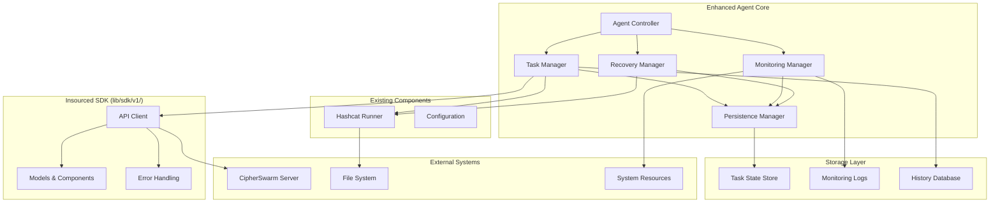
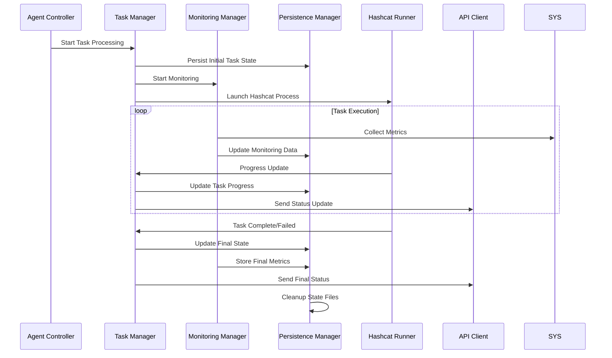

# Design Document

## Overview

The Enhanced Task Monitoring and Recovery System extends the existing CipherSwarmAgent with comprehensive monitoring, persistence, and recovery capabilities. The design maintains full compatibility with the existing v1 Agent API contract while adding robust task lifecycle management, real-time monitoring, and automatic recovery mechanisms.

The system is architected as a modular enhancement to the existing agent, introducing new components for monitoring, state persistence, and recovery while preserving all current functionality. This design incorporates the planned SDK insourcing strategy, replacing the external automatically-generated SDK with an internal implementation under `lib/sdk/v1/`. This approach provides better control over the API client implementation and supports the planned language migration by providing clear interfaces and well-defined component boundaries.

## Architecture

### High-Level Architecture



### Component Interaction Flow



## Components and Interfaces

### 0. Insourced SDK Architecture

**Purpose**: Replace the external automatically-generated SDK with an internal implementation that provides better control and supports the enhanced monitoring features.

**Idiomatic SDK Structure**:

```
lib/sdk/
├── client.go        # Main client with idiomatic interface
├── agent.go         # Agent-specific operations
├── task.go          # Task-specific operations  
├── attack.go        # Attack-specific operations
├── types.go         # Core data types
├── errors.go        # Error types and handling
└── internal/        # Internal HTTP client and utilities
    ├── http.go      # HTTP client with retry logic
    └── auth.go      # Authentication handling
```

**Idiomatic Client Design**:

```go
// Main client with service-oriented design
type Client struct {
    Agent  *AgentService
    Task   *TaskService
    Attack *AttackService
    
    // Internal HTTP client with built-in retry and auth
    http *internal.HTTPClient
}

// Constructor with options pattern
func NewClient(baseURL, token string, opts ...ClientOption) (*Client, error) {
    httpClient := internal.NewHTTPClient(baseURL, token)
    
    client := &Client{
        http: httpClient,
    }
    
    // Initialize services
    client.Agent = &AgentService{client: client}
    client.Task = &TaskService{client: client}
    client.Attack = &AttackService{client: client}
    
    // Apply options
    for _, opt := range opts {
        opt(client)
    }
    
    return client, nil
}

// Agent service with focused operations
type AgentService struct {
    client *Client
}

func (a *AgentService) Authenticate(ctx context.Context) (*Agent, error) { /* ... */ }
func (a *AgentService) GetConfiguration(ctx context.Context) (*Configuration, error) { /* ... */ }
func (a *AgentService) Update(ctx context.Context, agentID string, update AgentUpdate) (*Agent, error) { /* ... */ }
func (a *AgentService) Heartbeat(ctx context.Context, agentID string) (*AgentState, error) { /* ... */ }
func (a *AgentService) Shutdown(ctx context.Context, agentID string) error { /* ... */ }
func (a *AgentService) ReportError(ctx context.Context, agentID string, err AgentError) error { /* ... */ }
func (a *AgentService) SubmitBenchmark(ctx context.Context, agentID string, benchmark Benchmark) error { /* ... */ }

// Task service with focused operations
type TaskService struct {
    client *Client
}

func (t *TaskService) GetNew(ctx context.Context) (*Task, error) { /* ... */ }
func (t *TaskService) Accept(ctx context.Context, taskID string) error { /* ... */ }
func (t *TaskService) UpdateStatus(ctx context.Context, taskID string, status TaskStatus) error { /* ... */ }
func (t *TaskService) SubmitCrack(ctx context.Context, taskID string, result CrackResult) error { /* ... */ }
func (t *TaskService) MarkExhausted(ctx context.Context, taskID string) error { /* ... */ }

// Attack service with focused operations  
type AttackService struct {
    client *Client
}

func (a *AttackService) Get(ctx context.Context, attackID string) (*Attack, error) { /* ... */ }
func (a *AttackService) GetHashList(ctx context.Context, attackID string) (io.ReadCloser, error) { /* ... */ }

// Idiomatic data types (examples)
type Agent struct {
    ID              string    `json:"id"`
    Hostname        string    `json:"hostname"`
    ClientSignature string    `json:"client_signature"`
    OperatingSystem string    `json:"operating_system"`
    Devices         []string  `json:"devices"`
    State           AgentState `json:"state"`
}

type Task struct {
    ID       string `json:"id"`
    AttackID string `json:"attack_id"`
    Priority int    `json:"priority"`
    Status   TaskStatus `json:"status"`
}

type TaskStatus struct {
    Session         string    `json:"session"`
    Status          string    `json:"status"`
    Progress        []int64   `json:"progress"`
    RestorePoint    int64     `json:"restore_point"`
    RecoveredHashes int       `json:"recovered_hashes"`
    RecoveredSalts  int       `json:"recovered_salts"`
    Rejected        int       `json:"rejected"`
    DeviceStatuses  []DeviceStatus `json:"device_statuses"`
    TimeStart       time.Time `json:"time_start"`
    EstimatedStop   time.Time `json:"estimated_stop"`
}

// Client options for configuration
type ClientOption func(*Client)

func WithTimeout(timeout time.Duration) ClientOption {
    return func(c *Client) {
        c.http.SetTimeout(timeout)
    }
}

func WithRetryConfig(maxRetries int, backoff time.Duration) ClientOption {
    return func(c *Client) {
        c.http.SetRetryConfig(maxRetries, backoff)
    }
}
```

**Integration Benefits**:

- Direct control over retry logic and error handling
- Enhanced status updates with monitoring data
- Better integration with recovery mechanisms
- Simplified testing and mocking
- Support for future API enhancements

### 1. Task Manager Enhancement

**Purpose**: Extends existing task management with monitoring integration and state persistence.

**Key Interfaces**:

```go
type EnhancedTaskManager interface {
    StartTask(task *components.Task) error
    MonitorTask(taskID string) <-chan TaskEvent
    PauseTask(taskID string) error
    ResumeTask(taskID string) error
    GetTaskStatus(taskID string) (*TaskStatus, error)
    CleanupTask(taskID string) error
}

type TaskEvent struct {
    Type      TaskEventType
    TaskID    string
    Timestamp time.Time
    Data      interface{}
}
```

**Responsibilities**:

- Coordinate task execution with monitoring and persistence
- Handle task lifecycle events (start, pause, resume, complete)
- Integrate with existing hashcat runner and API client
- Manage task recovery scenarios

### 2. Monitoring Manager

**Purpose**: Provides real-time system and task monitoring with configurable thresholds.

**Key Interfaces**:

```go
type MonitoringManager interface {
    StartMonitoring(taskID string) error
    StopMonitoring(taskID string) error
    GetCurrentMetrics(taskID string) (*SystemMetrics, error)
    SetThresholds(config MonitoringConfig) error
    GetAlerts() <-chan MonitoringAlert
}

type SystemMetrics struct {
    Timestamp       time.Time
    CPUUsage        float64
    MemoryUsage     float64
    GPUTemperature  []float64
    GPUUtilization  []float64
    DiskSpace       int64
    HashRate        float64
    Progress        float64
}

type MonitoringAlert struct {
    Type      AlertType
    Severity  AlertSeverity
    Message   string
    Timestamp time.Time
    Metrics   *SystemMetrics
}
```

**Responsibilities**:

- Collect system metrics (CPU, memory, GPU temperature, disk space)
- Monitor hashcat process performance and progress
- Evaluate configurable thresholds and generate alerts
- Provide real-time metrics for status updates
- Support per-device monitoring for multi-GPU systems

### 3. Recovery Manager

**Purpose**: Handles automatic recovery from various failure scenarios.

**Key Interfaces**:

```go
type RecoveryManager interface {
    HandleNetworkFailure(taskID string) error
    HandleProcessCrash(taskID string, exitCode int) error
    HandleResourceThreshold(taskID string, alert MonitoringAlert) error
    AttemptTaskRecovery(taskID string) error
    ShouldRetryTask(taskID string, failureCount int) bool
}

type RecoveryStrategy struct {
    MaxRetries      int
    BackoffStrategy BackoffType
    RecoveryActions []RecoveryAction
}
```

**Responsibilities**:

- Implement exponential backoff for network failures
- Handle hashcat process crashes and restarts
- Manage resource-based throttling (temperature, memory)
- Coordinate with persistence manager for state recovery
- Report unrecoverable failures to the server

### 4. Persistence Manager

**Purpose**: Manages task state persistence and recovery data.

**Key Interfaces**:

```go
type PersistenceManager interface {
    SaveTaskState(state *TaskState) error
    LoadTaskState(taskID string) (*TaskState, error)
    UpdateProgress(taskID string, progress TaskProgress) error
    CleanupTaskState(taskID string) error
    GetIncompleteTasksOnStartup() ([]*TaskState, error)
    SaveMonitoringData(taskID string, metrics *SystemMetrics) error
    GetTaskHistory(filters HistoryFilters) ([]*TaskHistoryEntry, error)
}

type TaskState struct {
    TaskID          string
    AttackID        string
    Status          TaskStatus
    HashcatParams   []string
    Progress        TaskProgress
    StartTime       time.Time
    LastUpdate      time.Time
    FailureCount    int
    RecoveryData    map[string]interface{}
}

type TaskProgress struct {
    KeyspacePosition int64
    ProgressPercent  float64
    HashesRecovered  int
    RestorePoint     int64
    EstimatedStop    time.Time
}
```

**Responsibilities**:

- Persist task state to local storage (JSON format)
- Manage atomic updates to prevent corruption
- Handle task state cleanup on completion
- Provide task history and analytics data
- Support agent-specific state directories for multi-agent systems

### 5. Configuration Enhancement

**Purpose**: Extends existing configuration with monitoring and recovery settings.

**New Configuration Options**:

```yaml
monitoring:
  enabled: true
  interval_seconds: 3
  gpu_temp_threshold: 80
  memory_threshold_percent: 90
  disk_space_threshold_gb: 1
  per_device_thresholds: {}

recovery:
  max_retries: 3
  network_backoff_start_seconds: 1
  network_backoff_max_seconds: 300
  process_restart_delay_seconds: 5
  temperature_resume_delta: 5

persistence:
  enabled: true
  state_directory: states
  history_retention_days: 30
  history_max_size_mb: 100
  cleanup_on_completion: true

analytics:
  enabled: true
  export_formats: [json, csv]
  performance_tracking: true
```

## Data Models

### Task State Schema

```json
{
  "task_id": "string",
  "attack_id": "string",
  "status": "running|paused|completed|failed",
  "hashcat_params": [
    "array",
    "of",
    "strings"
  ],
  "progress": {
    "keyspace_position": 12345,
    "progress_percent": 45.6,
    "hashes_recovered": 10,
    "restore_point": 12340,
    "estimated_stop": "2024-01-01T12:00:00Z"
  },
  "start_time": "2024-01-01T10:00:00Z",
  "last_update": "2024-01-01T11:30:00Z",
  "failure_count": 0,
  "recovery_data": {
    "last_checkpoint": 12340,
    "network_failures": 0,
    "process_restarts": 0
  },
  "monitoring_summary": {
    "avg_hash_rate": 1000000,
    "peak_gpu_temp": 75,
    "avg_gpu_util": 95
  }
}
```

### Monitoring Data Schema

```json
{
  "timestamp": "2024-01-01T12:00:00Z",
  "task_id": "string",
  "system_metrics": {
    "cpu_usage": 45.2,
    "memory_usage": 78.5,
    "disk_space_gb": 150,
    "gpu_devices": [
      {
        "device_id": 0,
        "temperature": 75,
        "utilization": 95,
        "memory_usage": 80
      }
    ]
  },
  "task_metrics": {
    "hash_rate": 1000000,
    "progress_percent": 45.6,
    "hashes_recovered": 10,
    "session_uptime": 3600
  }
}
```

## Error Handling

### Error Categories and Responses

1. **Network Failures**

   - Implement exponential backoff (1s to 300s)
   - Pause task execution during network outages
   - Resume from last checkpoint when connectivity restored
   - Report to server using existing `/agents/{id}/submit_error` endpoint

2. **Process Crashes**

   - Capture exit codes and stderr output
   - Automatic restart with identical parameters
   - Resume from last restore point
   - Fail task after 3 consecutive crashes

3. **Resource Threshold Violations**

   - GPU temperature: Pause until temp drops 5°C below threshold
   - Memory usage: Log warning, continue monitoring
   - Disk space: Pause task, alert operator
   - Configurable per-threshold actions

4. **State Persistence Failures**

   - Log errors but continue task execution
   - Attempt recovery on next state update
   - Graceful degradation without blocking operations

### Integration with Idiomatic SDK Error Handling

The enhanced system integrates with the idiomatic SDK's error handling and maintains compatibility with the current error reporting mechanisms:

```go
// Enhanced error reporting with monitoring context using idiomatic SDK
func LogAndSendErrorWithContext(message string, err error, severity ErrorSeverity, task *Task, context MonitoringContext) error {
    // Enhanced error reporting with system state context
    agentError := AgentError{
        Message: message,
        Error: err.Error(),
        Severity: severity,
        Context: map[string]interface{}{
            "system_metrics": context.CurrentMetrics,
            "task_state": context.TaskState,
            "recovery_attempts": context.RecoveryAttempts,
        },
        Timestamp: time.Now(),
    }
    
    // Use idiomatic SDK client for error reporting
    return shared.State.Client.Agent.ReportError(context.Background(), shared.State.AgentID, agentError)
}

// Enhanced client wrapper with monitoring integration
type EnhancedClient struct {
    *sdk.Client
    monitoring *MonitoringManager
    recovery   *RecoveryManager
}

func NewEnhancedClient(baseURL, token string, monitoring *MonitoringManager, recovery *RecoveryManager) (*EnhancedClient, error) {
    client, err := sdk.NewClient(baseURL, token,
        sdk.WithTimeout(30*time.Second),
        sdk.WithRetryConfig(3, time.Second),
    )
    if err != nil {
        return nil, err
    }
    
    return &EnhancedClient{
        Client: client,
        monitoring: monitoring,
        recovery: recovery,
    }, nil
}

func (e *EnhancedClient) UpdateStatusWithMonitoring(ctx context.Context, taskID string, status TaskStatus) error {
    // Enhance status with monitoring data
    if metrics, err := e.monitoring.GetCurrentMetrics(taskID); err == nil {
        status.SystemMetrics = metrics
    }
    
    // Use idiomatic SDK with built-in retry logic
    return e.Task.UpdateStatus(ctx, taskID, status)
}
```

## Testing Strategy

### Unit Testing

1. **Component Isolation**

   - Mock external dependencies (API client, file system, system metrics)
   - Test each component interface independently
   - Validate error handling and edge cases

2. **State Management Testing**

   - Test persistence operations with various failure scenarios
   - Validate atomic updates and corruption prevention
   - Test state recovery on agent restart

3. **Monitoring Logic Testing**

   - Test threshold evaluation with mock metrics
   - Validate alert generation and severity levels
   - Test configuration loading and validation

### Integration Testing

1. **Task Lifecycle Testing**

   - End-to-end task execution with monitoring
   - Recovery scenario testing (network failures, process crashes)
   - Multi-task concurrent execution testing

2. **API Compatibility Testing**

   - Validate all existing API endpoints continue to work
   - Test enhanced status updates with monitoring data
   - Verify error reporting format compatibility

3. **Cross-Platform Testing**

   - Test on Linux, macOS, and Windows
   - Validate device detection and monitoring on different platforms
   - Test file system operations and permissions

### Performance Testing

1. **Monitoring Overhead**

   - Measure performance impact of monitoring on task execution
   - Validate configurable monitoring intervals
   - Test resource usage of monitoring components

2. **State Persistence Performance**

   - Test persistence operations under high-frequency updates
   - Validate cleanup operations don't impact performance
   - Test concurrent access scenarios

### Compatibility Testing

1. **Backward Compatibility**

   - Ensure existing configurations continue to work
   - Test with existing server API versions
   - Validate migration from current agent versions

2. **Forward Compatibility**

   - Design interfaces to support future enhancements
   - Test configuration schema extensibility
   - Validate API contract flexibility

## Implementation Considerations

### Language Migration Support

The design supports the planned language migration through:

1. **Clear Interface Definitions**: All components have well-defined interfaces that can be implemented in any language
2. **Data Format Standardization**: JSON-based persistence and configuration for language-agnostic data exchange
3. **API Contract Preservation**: Strict adherence to existing API contracts ensures server compatibility through the insourced SDK
4. **Modular Architecture**: Components can be migrated incrementally without breaking functionality
5. **SDK Insourcing Benefits**: The insourced SDK provides a clear reference implementation that can be ported to the new language while maintaining exact API compatibility

### SDK Migration Strategy

The insourced SDK facilitates language migration by:

1. **Reference Implementation**: Provides a complete, tested implementation of the API client that can be used as a reference for the new language
2. **API Contract Documentation**: The SDK code serves as living documentation of the exact API requirements
3. **Testing Framework**: Existing SDK tests can be used to validate the new language implementation
4. **Incremental Migration**: The SDK can be migrated component by component (auth, tasks, agents, etc.)
5. **Compatibility Validation**: The insourced SDK ensures that any new implementation maintains exact compatibility with the server

### Cross-Platform Compatibility

1. **File System Operations**: Use platform-agnostic path handling and permissions
2. **Process Management**: Abstract process control for different operating systems
3. **System Metrics**: Use cross-platform libraries for system monitoring
4. **Configuration**: Support platform-specific configuration overrides

### Security Considerations

1. **State File Security**: Encrypt sensitive data in state files
2. **API Token Protection**: Secure storage and transmission of authentication tokens
3. **File Permissions**: Restrict access to agent data directories
4. **Logging Security**: Prevent sensitive data leakage in logs

### Scalability and Performance

1. **Monitoring Efficiency**: Configurable monitoring intervals to balance accuracy and performance
2. **State Management**: Efficient state updates with minimal I/O operations
3. **Memory Management**: Bounded memory usage for monitoring data and history
4. **Concurrent Operations**: Thread-safe operations for multi-task scenarios
