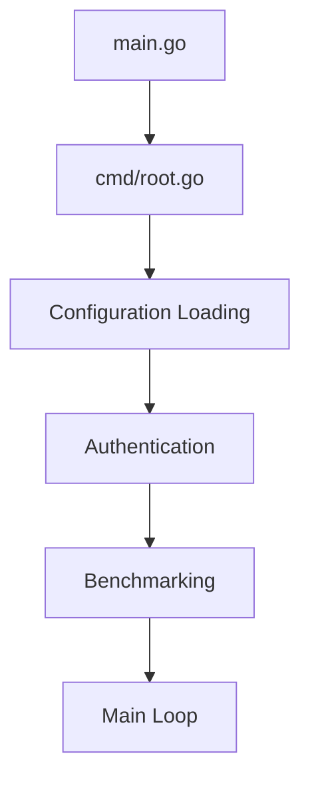
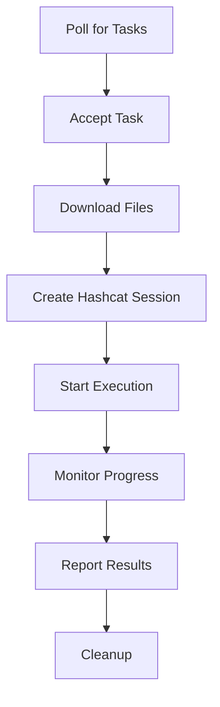
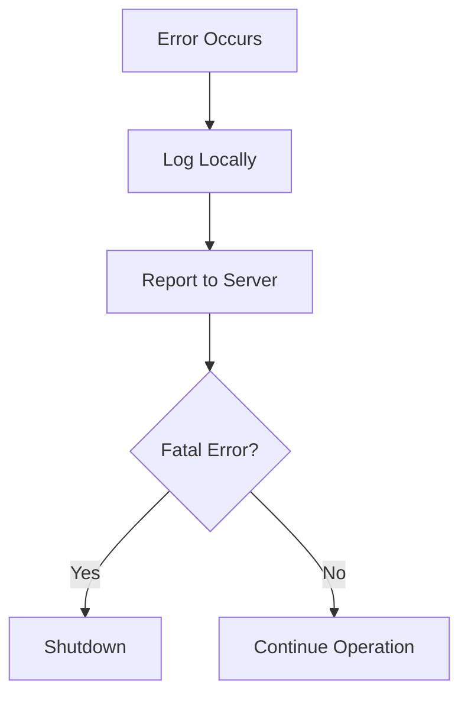

# Project Structure

This document explains the organization and architecture of the CipherSwarm Agent codebase.

## Overview

The CipherSwarm Agent is built with Go 1.26+ and follows a modular architecture for maintainability and testability. The project structure separates concerns into logical modules and provides clear interfaces between components.

## Directory Layout

```text
CipherSwarmAgent/
├── cmd/                    # CLI entrypoint and command registration
├── lib/                    # Core agent logic and utilities
│   ├── agent/             # Agent lifecycle (startup, heartbeat, shutdown)
│   ├── api/               # API client layer (generated + hand-written)
│   ├── apierrors/         # Generic API error handler
│   ├── arch/              # OS-specific abstractions
│   ├── benchmark/         # Benchmark execution, caching, and submission
│   ├── config/            # Configuration defaults as exported constants
│   ├── cracker/           # Hashcat binary discovery and extraction
│   ├── cserrors/          # Centralized error reporting
│   ├── display/           # User-facing output (status, progress)
│   ├── downloader/        # File download with checksum verification
│   ├── hashcat/           # Hashcat session management and parsing
│   ├── progress/          # Progress calculation utilities
│   ├── task/              # Task lifecycle management
│   ├── testdata/          # Test fixtures and data files
│   ├── testhelpers/       # Shared test helpers and mocks
│   └── zap/               # Zap file monitoring for cracked hashes
├── agentstate/             # Global agent state, loggers, synchronized fields
├── docs/                   # Documentation (this directory)
├── .github/               # GitHub workflows and templates
├── .chglog/               # Changelog configuration
├── Dockerfile             # Container build for agent
├── Dockerfile.releaser    # Container for releases
├── go.mod                 # Go module definition
├── go.sum                 # Go module checksums
├── justfile               # Command runner configuration
├── main.go                # Application entrypoint
├── mise.toml              # Dev toolchain management
├── mkdocs.yml             # Documentation configuration
└── README.md              # Project overview
```

## Core Modules

### 1. Main Entrypoint (`main.go`)

The application's entry point that delegates to the Cobra CLI framework.

```go
package main

import "github.com/unclesp1d3r/cipherswarmagent/cmd"

func main() {
    cmd.Execute()
}
```

### 2. Command Interface (`cmd/`)

#### `cmd/root.go`

- **Purpose**: Cobra CLI command definition and configuration
- **Key Functions**:
    - Command-line flag parsing and Viper binding
    - Configuration initialization (`initConfig`)
    - Agent lifecycle startup (`startAgent`)
    - Signal handling for graceful shutdown

### 3. Agent State (`agentstate/`)

#### `agentstate/agentstate.go`

- **Purpose**: Global application state and configuration
- **Key Types**:
    - `State`: Runtime state with synchronized fields (`atomic.Bool`, `sync.RWMutex`)
    - `CurrentActivity`: Current agent activity enum
- **Globals**:
    - `State`: Shared agent state (access via getter/setter methods only)
    - `Logger`: Application logger (`charmbracelet/log`)

### 4. Core Library (`lib/`)

The main business logic of the agent, organized by functional area:

#### `lib/agentClient.go`

- **Purpose**: Server communication and configuration mapping
- **Key Functions**:
    - `AuthenticateAgent()`: Server authentication
    - `GetAgentConfiguration()`: Fetch and map server configuration
    - `UpdateAgentMetadata()`: Send agent info to server
    - `SendHeartBeat()`: Periodic health check
    - `mapConfiguration()`: Map API response to internal config

#### `lib/dataTypes.go`

- **Purpose**: Core data structures and type definitions
- **Key Types**:
    - `agentConfiguration`: Internal configuration structure
    - Type conversion utilities

#### `lib/errorUtils.go`

- **Purpose**: Error handling helpers for API responses
- **Key Functions**:
    - Error type handlers for specific API operations (heartbeat, status, task, etc.)

#### `lib/crackerUtils.go`

- **Purpose**: Hashcat binary path management
- **Key Functions**:
    - `setNativeHashcatPath()`: Configure native binary usage

### 5. Agent Lifecycle (`lib/agent/`)

#### `lib/agent/agent.go`

- **Purpose**: Agent main loop and lifecycle management
- **Key Functions**:
    - `StartAgent()`: Main agent loop (heartbeat, task polling, benchmark gating)
    - `sleepWithContext()`: Context-aware sleep utility

### 6. API Client Layer (`lib/api/`)

#### `lib/api/client.gen.go`

- **Purpose**: Auto-generated API client from OpenAPI spec (oapi-codegen)
- **Note**: Never modify manually — regenerate with `just generate`

#### `lib/api/client.go`

- **Purpose**: Hand-written API client wrapper
- **Key Types**:
    - `AgentClient`: Wraps `ClientWithResponses`, implements `APIClient` interface
    - Sub-clients: `Tasks()`, `Attacks()`, `Agents()`, `Auth()`

#### `lib/api/interfaces.go`

- **Purpose**: `APIClient` aggregate interface for all sub-client operations

#### `lib/api/errors.go`

- **Purpose**: API error types (`APIError` wrapper for generated `ErrorObject`)

#### `lib/api/mock.go`

- **Purpose**: Mock implementations for testing

### 7. API Error Handler (`lib/apierrors/`)

#### `lib/apierrors/handler.go`

- **Purpose**: Generic API error handler (`Handler`) for log-or-send error handling

### 8. Benchmark System (`lib/benchmark/`)

#### `lib/benchmark/manager.go`

- **Purpose**: Benchmark execution and incremental submission
- **Key Types**:
    - `Manager`: Orchestrates benchmark sessions with constructor injection
- **Key Functions**:
    - `UpdateBenchmarks()`: Run full benchmark session
    - `TrySubmitCachedBenchmarks()`: Submit cached results on startup

#### `lib/benchmark/cache.go`

- **Purpose**: Persistent benchmark cache at `{data_path}/benchmark_cache.json`
- **Key Functions**:
    - `saveBenchmarkCache()`, `loadBenchmarkCache()`: Cache persistence
    - `cacheAndSubmitBenchmarks()`: Combined cache + submit with early-return

#### `lib/benchmark/parse.go`

- **Purpose**: Benchmark output parsing from hashcat stdout

### 9. Configuration (`lib/config/`)

#### `lib/config/config.go`

- **Purpose**: Configuration defaults as exported constants
- **Key Functions**:
    - `SetDefaultConfigValues()`: Register viper defaults
    - `SetupSharedState()`: Wire config into `agentstate.State`

### 10. Hashcat Integration (`lib/hashcat/`)

#### `lib/hashcat/session.go`

- **Purpose**: Hashcat process lifecycle management
- **Key Types**:
    - `Session`: Represents a running Hashcat instance with context-aware I/O goroutines
- **Key Functions**:
    - `NewHashcatSession()`: Create configured session
    - `Start()`: Launch Hashcat process with stdout/stderr/tailer goroutines
    - `Kill()`: Terminate process gracefully
    - `Cleanup()`: Resource cleanup (temp files, charset files)

#### `lib/hashcat/params.go`

- **Purpose**: Hashcat parameter configuration and validation
- **Key Types**:
    - `Params`: Attack configuration structure
- **Key Functions**:
    - `Validate()`: Parameter validation per attack mode
    - `toCmdArgs()`: Command-line argument generation

#### `lib/hashcat/types.go`

- **Purpose**: Hashcat data structures (Status, Result, StatusDevice)

#### `lib/hashcat/exitcode.go`

- **Purpose**: Hashcat exit code interpretation

#### `lib/hashcat/errorparser.go`

- **Purpose**: Hashcat stderr error message parsing

### 11. Task Management (`lib/task/`)

#### `lib/task/manager.go`

- **Purpose**: Task acceptance and lifecycle
- **Key Functions**:
    - `AcceptTask()`, `AbandonTask()`, `MarkTaskExhausted()`

#### `lib/task/runner.go`

- **Purpose**: Task execution with hashcat
- **Key Functions**:
    - `RunTask()`: Main task runner

#### `lib/task/status.go`

- **Purpose**: Status update submission during task execution

#### `lib/task/download.go`

- **Purpose**: Task resource downloads (hash lists, wordlists, rules)

#### `lib/task/cleanup.go`

- **Purpose**: Post-task cleanup

#### `lib/task/errors.go`

- **Purpose**: Task-specific error handling

### 12. Centralized Error Reporting (`lib/cserrors/`)

#### `lib/cserrors/errors.go`

- **Purpose**: Error reporting to server
- **Key Functions**:
    - `SendAgentError()`: Report errors with severity and metadata
    - `LogAndSendError()`: Combined logging and server reporting

### 13. OS Abstractions (`lib/arch/`)

Platform-specific functionality for cross-platform support:

- **`linux.go`**: Linux device detection
- **`darwin.go`**: macOS (Intel + Apple Silicon) support
- **`windows.go`**: Windows device detection

**Common Functions**: `GetDevices()`, `GetHashcatVersion()`, `Extract7z()`, `GetDefaultHashcatBinaryName()`

### 14. Supporting Packages

#### `lib/cracker/` — Hashcat binary discovery and archive extraction

#### `lib/display/` — User-facing output formatting

#### `lib/downloader/` — File download with checksum verification and retries

#### `lib/progress/` — Progress calculation utilities

#### `lib/zap/` — Zap file monitoring for cracked hashes (shared cracking)

#### `lib/testhelpers/` — Shared test fixtures, HTTP mocking, and state setup

## Architecture Patterns

### 1. Modular Design

Each major functional area is separated into its own sub-package under `lib/`:

- **Separation of Concerns**: Clear boundaries between functionality
- **Testability**: Modules can be tested independently with constructor injection
- **Maintainability**: Changes are localized to relevant packages

### 2. Interface-Based Design

Key interfaces abstract dependencies for testing:

- **`APIClient`**: Aggregate interface for all API operations (`lib/api/interfaces.go`)
- **OS Abstractions**: Platform-specific code isolated in `arch/`
- **Mock Support**: `lib/api/mock.go` and `lib/testhelpers/` for test isolation

### 3. Configuration Management

Multi-layered configuration system:

- **Command-line flags** (highest priority)
- **Environment variables**
- **Configuration files** (`cipherswarmagent.yaml`)
- **Default values** (lowest priority, from `lib/config/config.go`)

### 4. Error Handling

Centralized error management:

- **Structured Errors**: `api.APIError` wraps generated error types
- **Error Reporting**: `cserrors.SendAgentError()` reports to server with metadata
- **Graceful Degradation**: Non-fatal error recovery with exponential backoff

### 5. State Management

Global state with synchronized access:

- **`agentstate.State`**: Runtime state with `atomic.Bool` and `sync.RWMutex` fields
- **Getter/Setter Methods**: Never access synchronized fields directly
- **Immutable Configuration**: `lib.Configuration` is set once at startup and on reload

## Data Flow

### 1. Startup Sequence



### 2. Task Execution Flow



### 3. Error Handling Flow



## Testing Structure

### Unit Tests

- **File Pattern**: `*_test.go` within the same package
- **Naming**: `TestFunctionName_Scenario`
- **Style**: Table-driven tests for core logic
- **Mocking**: `lib/api/mock.go` for API, `lib/testhelpers/` for shared fixtures
- **Note**: `hashcat` package cannot import `testhelpers` (circular dependency) — use local helpers

### Test Helpers (`lib/testhelpers/`)

- `fixtures.go`: Common test data setup
- `http_mock.go`: HTTP server mocking (`SetupHTTPMock`)
- `state_helper.go`: Agent state setup (`SetupTestState`, `SetupMinimalTestState`)
- `error_helpers.go`: Test error utilities
- `mock_session.go`: Hashcat session mocking
- `assertions.go`: Custom test assertions

## Build and Release

### Development Build

```bash
# Local development
go build -o cipherswarm-agent

# Using just
just install
```

### Release Build

- **GoReleaser**: Automated release builds via `.goreleaser.yaml`
- **Cross-compilation**: Linux, macOS, Windows (amd64, arm64)
- **Packaging**: Binaries, .deb, .rpm, .pkg.tar.xz, and Docker images
- **Distribution**: GitHub releases and `ghcr.io` container registry

### Docker Build

- **Multi-stage**: Separate build and runtime stages
- **Variants**: Standard (GPU) and POCL (CPU-only)
- **Tags**: `latest`, `pocl`, version-specific

## Dependencies

### Core Dependencies

- **Cobra**: CLI framework and command parsing
- **Viper**: Configuration management
- **charmbracelet/log**: Structured logging
- **oapi-codegen**: OpenAPI client generation

### Build Dependencies

- **GoReleaser**: Release automation
- **Just**: Command runner
- **mise**: Dev toolchain management
- **MkDocs**: Documentation generation (Material theme)

### Optional Dependencies

- **Hashcat**: Hash cracking engine (bundled in Docker)
- **7zip**: Archive extraction

## Next Steps

- Review [Configuration](configuration.md) for setup options
- Check [Usage](usage.md) for operational guidance
- See [Contributing](contributing.md) to help improve the project
