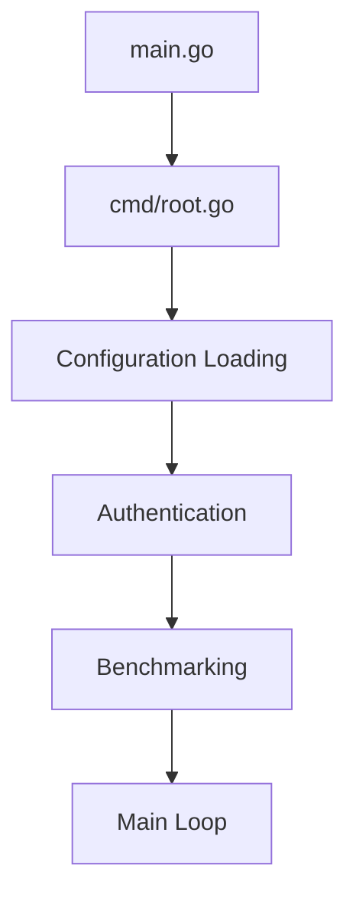
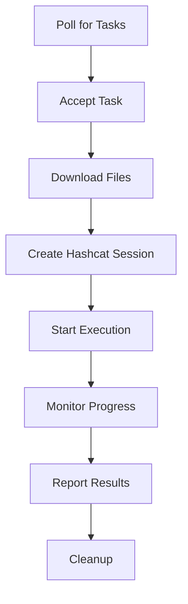
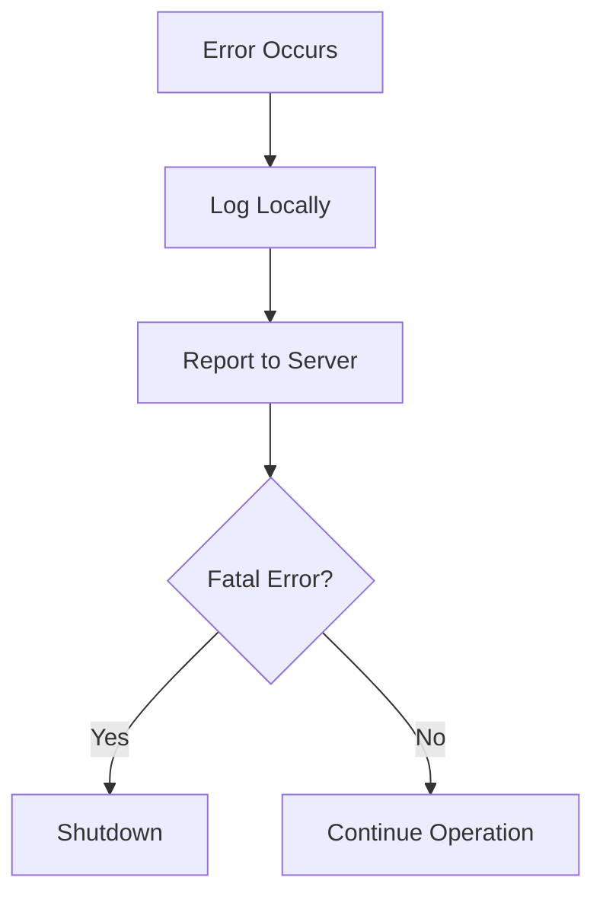

# Project Structure

This document explains the organization and architecture of the CipherSwarm Agent codebase.

## Overview

The CipherSwarm Agent is built with Go 1.22+ and follows a modular architecture for maintainability and testability. The project structure separates concerns into logical modules and provides clear interfaces between components.

## Directory Layout

```text
CipherSwarmAgent/
├── cmd/                    # CLI entrypoint and command registration
├── lib/                    # Core agent logic and utilities
│   ├── arch/              # OS-specific abstractions
│   ├── hashcat/           # Hashcat integration
│   └── utils/             # Reusable utilities
├── shared/                 # Global state and shared types
├── docs/                   # Documentation (this directory)
├── .github/               # GitHub workflows and templates
├── .chglog/               # Changelog configuration
├── .cursor/               # Cursor editor configuration
├── .devcontainer/         # VS Code dev container
├── Dockerfile             # Container build for agent
├── Dockerfile.releaser    # Container for releases
├── go.mod                 # Go module definition
├── go.sum                 # Go module checksums
├── justfile               # Command runner configuration
├── main.go                # Application entrypoint
├── mkdocs.yml             # Documentation configuration
└── README.md              # Project overview
```

## Core Modules

### 1. Main Entrypoint (`main.go`)

The application's entry point that delegates to the Cobra CLI framework.

```go
package main

import "github.com/unclesp1d3r/cipherswarmagent/cmd"

func main() {
    cmd.Execute()
}
```

### 2. Command Interface (`cmd/`)

#### `cmd/root.go`

- **Purpose**: Cobra CLI command definition and configuration
- **Key Functions**:
  - Command-line flag parsing
  - Configuration binding (Viper)
  - Agent lifecycle management
  - Signal handling for graceful shutdown

**Key Components**:

- `rootCmd`: Main Cobra command definition
- `initConfig()`: Configuration initialization
- `startAgent()`: Main agent execution loop
- Flag definitions for all configuration options

### 3. Core Library (`lib/`)

The main business logic of the agent, organized by functional area:

#### `lib/agentClient.go`

- **Purpose**: Primary agent logic and server communication
- **Key Functions**:
  - `AuthenticateAgent()`: Server authentication
  - `GetAgentConfiguration()`: Fetch server configuration
  - `UpdateAgentMetadata()`: Send agent info to server
  - `SendHeartBeat()`: Periodic health check
  - `DownloadFiles()`: Attack resource downloads

#### `lib/taskManager.go`

- **Purpose**: Task lifecycle management
- **Key Functions**:
  - `GetNewTask()`: Poll for available tasks
  - `AcceptTask()`: Accept and prepare task
  - `RunTask()`: Execute task with Hashcat
  - `markTaskExhausted()`: Mark task complete

#### `lib/benchmarkManager.go`

- **Purpose**: Device benchmarking and capability detection
- **Key Functions**:
  - `UpdateBenchmarks()`: Run performance benchmarks
  - `sendBenchmarkResults()`: Submit results to server
  - `runBenchmarkTask()`: Execute benchmark session

#### `lib/errorUtils.go`

- **Purpose**: Centralized error handling and reporting
- **Key Functions**:
  - `SendAgentError()`: Report errors to server
  - `handleAPIError()`: API error processing
  - `logAndSendError()`: Combined logging and reporting

#### `lib/fileUtils.go`

- **Purpose**: File operations and download management
- **Key Functions**:
  - `downloadFile()`: Secure file downloads with checksums
  - `fileExistsAndValid()`: File validation
  - `writeCrackedHashToFile()`: Result file management

#### `lib/clientUtils.go`

- **Purpose**: System utilities and helper functions
- **Key Functions**:
  - `findHashcatBinary()`: Locate Hashcat executable
  - `CreateLockFile()`: Process management
  - `CreateDataDirs()`: Directory structure setup

#### `lib/crackerUtils.go`

- **Purpose**: Hashcat binary management
- **Key Functions**:
  - `UpdateCracker()`: Download/update Hashcat binaries
  - `setNativeHashcatPath()`: Configure native binary usage

#### `lib/runners.go`

- **Purpose**: Task execution and monitoring
- **Key Functions**:
  - `runAttackTask()`: Main task runner
  - `handleStdOutLine()`: Process Hashcat output
  - `handleCrackedHash()`: Process found hashes

#### `lib/outputs.go`

- **Purpose**: User interface and logging output
- **Key Functions**:
  - `DisplayStartup()`: Startup messages
  - `DisplayNewTask()`: Task information display
  - Various status and progress displays

#### `lib/dataTypes.go`

- **Purpose**: Core data structures and type definitions
- **Key Types**:
  - `agentConfig`: Configuration structure
  - `benchmarkResult`: Performance data
  - Type conversion utilities

### 4. Hashcat Integration (`lib/hashcat/`)

Specialized module for Hashcat process management:

#### `lib/hashcat/session.go`

- **Purpose**: Hashcat process lifecycle management
- **Key Types**:
  - `Session`: Represents a running Hashcat instance
- **Key Functions**:
  - `NewHashcatSession()`: Create configured session
  - `Start()`: Launch Hashcat process
  - `Kill()`: Terminate process gracefully
  - `Cleanup()`: Resource cleanup

#### `lib/hashcat/params.go`

- **Purpose**: Hashcat parameter configuration
- **Key Types**:
  - `Params`: Attack configuration structure
- **Key Functions**:
  - `Validate()`: Parameter validation
  - `toCmdArgs()`: Command-line argument generation
  - Attack mode-specific parameter handling

#### `lib/hashcat/types.go`

- **Purpose**: Hashcat data structure definitions
- **Key Types**:
  - `Status`: Real-time status information
  - `Result`: Cracked hash results
  - `StatusDevice`: GPU/CPU device status

### 5. OS Abstractions (`lib/arch/`)

Platform-specific functionality for cross-platform support:

#### `lib/arch/linux.go`

- Linux-specific implementations
- Device detection via system tools
- Native package manager integration

#### `lib/arch/darwin.go`

- macOS-specific implementations
- Apple Silicon and Intel support
- Homebrew integration support

#### `lib/arch/windows.go`

- Windows-specific implementations
- PowerShell-based device detection
- Windows package manager support

**Common Interface**:

- `GetDevices()`: Device enumeration
- `GetHashcatVersion()`: Version detection
- `Extract7z()`: Archive extraction
- `GetDefaultHashcatBinaryName()`: Platform binary names

### 6. Utilities (`lib/utils/`)

#### `lib/utils/progress_tracking.go`

- **Purpose**: Download progress monitoring
- **Key Types**:
  - `progressBar`: Progress display management
- **Features**:
  - Real-time download progress
  - Multiple concurrent progress bars
  - Terminal-friendly display

### 7. Shared State (`shared/`)

#### `shared/shared.go`

- **Purpose**: Global application state and configuration
- **Key Types**:
  - `agentState`: Runtime state management
  - `activity`: Current agent activity enum
- **Global Variables**:
  - `State`: Shared agent state
  - `Logger`: Application logger
  - `ErrorLogger`: Error-specific logger

## Architecture Patterns

### 1. Modular Design

Each major functional area is separated into its own module:

- **Separation of Concerns**: Clear boundaries between functionality
- **Testability**: Modules can be tested independently
- **Maintainability**: Changes are localized to relevant modules

### 2. Interface-Based Design

Key interfaces abstract platform-specific functionality:

- **OS Abstractions**: Platform-specific code isolated in `arch/`
- **Hashcat Integration**: Clean interface to external process
- **Network Operations**: Abstracted API communication

### 3. Configuration Management

Multi-layered configuration system:

- **Command-line flags** (highest priority)
- **Environment variables**
- **Configuration files**
- **Default values** (lowest priority)

### 4. Error Handling

Centralized error management:

- **Structured Errors**: Custom error types with context
- **Error Reporting**: Automatic server notification
- **Graceful Degradation**: Non-fatal error recovery

### 5. State Management

Global state management with clear ownership:

- **Shared State**: Global configuration and runtime state
- **Local State**: Module-specific state management
- **Immutable Configuration**: Runtime configuration is read-only

## Data Flow

### 1. Startup Sequence



### 2. Task Execution Flow



### 3. Error Handling Flow



## Testing Structure

### Unit Tests

- **File Pattern**: `*_test.go`
- **Coverage**: Core logic and utilities
- **Mocking**: External dependencies mocked
- **Examples**:
  - `lib/agentClient_test.go`
  - `lib/clientUtils_test.go`

### Integration Tests

- **Purpose**: Test component interactions
- **Scope**: API communication, file operations
- **Environment**: Controlled test environment

### Benchmark Tests

- **Purpose**: Performance testing
- **Scope**: Critical path operations
- **Metrics**: CPU, memory, and network usage

## Build and Release

### Development Build

```bash
# Local development
go build -o cipherswarm-agent

# With build info
go build -ldflags "-X main.version=dev -X main.commit=$(git rev-parse HEAD)"
```

### Release Build

- **GoReleaser**: Automated release builds
- **Cross-compilation**: Multiple OS/architecture support
- **Packaging**: Binaries, packages (deb/rpm), and Docker images
- **Distribution**: GitHub releases and container registries

### Docker Build

- **Multi-stage**: Separate build and runtime stages
- **Base Images**: Hashcat-enabled base images
- **Variants**: Standard and POCL (CPU-only) versions

## Development Guidelines

### Code Organization

1. **Single Responsibility**: Each function has one clear purpose
2. **Clear Naming**: Functions and variables have descriptive names
3. **Error Handling**: All errors are handled appropriately
4. **Documentation**: Public APIs have Go doc comments

### Adding New Features

1. **Design**: Consider where new functionality belongs
2. **Interfaces**: Define clean interfaces for new components
3. **Testing**: Add unit tests for new functionality
4. **Documentation**: Update relevant documentation

### Platform Support

When adding platform-specific code:

1. **Abstraction**: Use the `arch/` package pattern
2. **Interface**: Define common interfaces
3. **Fallbacks**: Provide sensible defaults
4. **Testing**: Test on all supported platforms

## Dependencies

### Core Dependencies

- **Cobra**: CLI framework and command parsing
- **Viper**: Configuration management
- **Loguru**: Structured logging
- **CipherSwarm SDK**: API client library

### Build Dependencies

- **GoReleaser**: Release automation
- **Just**: Command runner
- **MkDocs**: Documentation generation

### Optional Dependencies

- **Hashcat**: Hash cracking engine (bundled in Docker)
- **7zip**: Archive extraction

## Security Considerations

### Secure Coding Practices

1. **Input Validation**: All external input is validated
2. **Safe File Operations**: Path traversal protection
3. **Secure Communications**: TLS for all API calls
4. **Credential Handling**: No credentials in logs or memory dumps

### Threat Model

- **Network Attacks**: TLS and authentication protect API communication
- **File System Attacks**: Restricted file operations and validation
- **Process Attacks**: Secure process management and cleanup

## Contributing

### Getting Started

1. **Fork**: Fork the repository on GitHub
2. **Clone**: Clone your fork locally
3. **Setup**: Run `just install` to set up development environment
4. **Branch**: Create a feature branch
5. **Develop**: Make your changes following the guidelines
6. **Test**: Run `just ci-check` to verify changes
7. **Submit**: Create a pull request

### Code Review Process

1. **Automated Checks**: CI runs tests and linting
2. **Manual Review**: Maintainers review code and design
3. **Feedback**: Address review comments
4. **Merge**: Approved changes are merged

For more detailed contributing information, see [Contributing](contributing.md).

## Next Steps

- Review [Configuration](configuration.md) for setup options
- Check [Usage](usage.md) for operational guidance
- See [Contributing](contributing.md) to help improve the project
